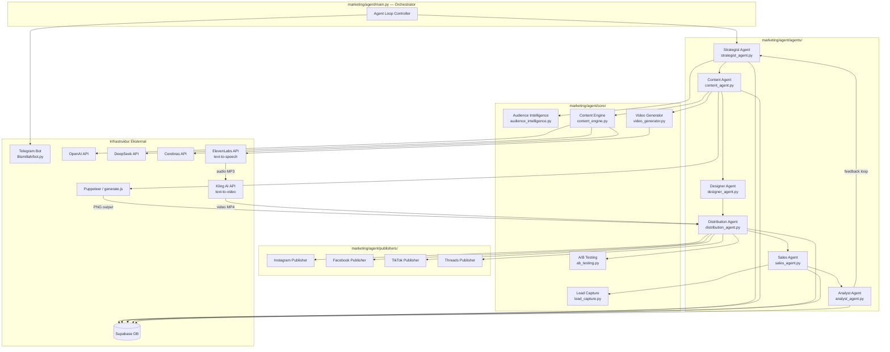
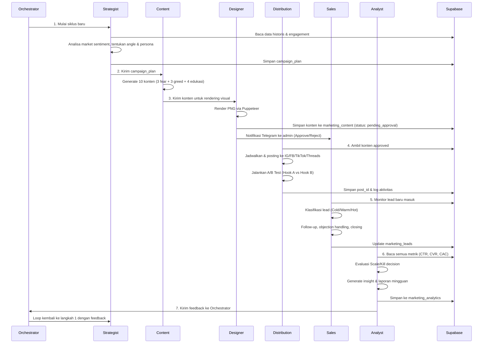
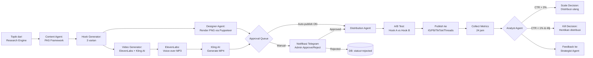
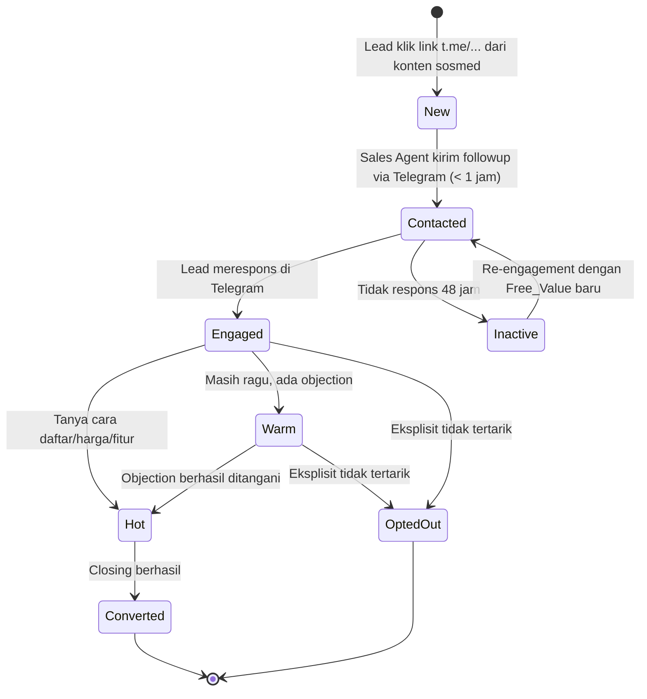
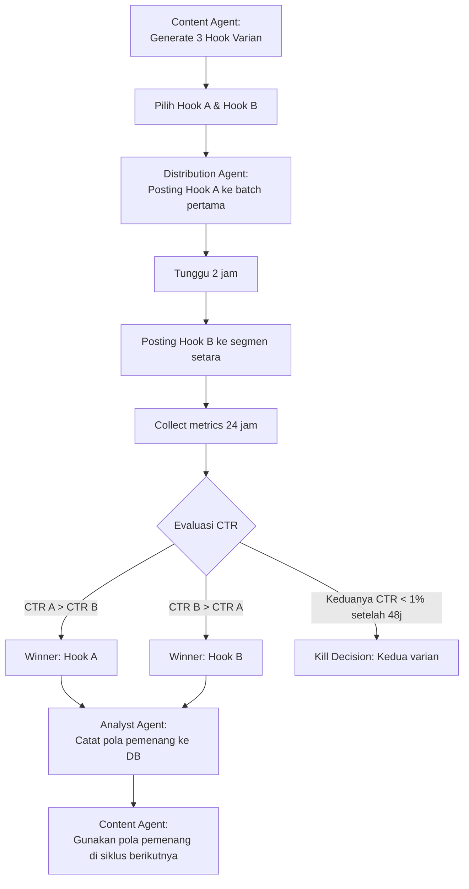

# Dokumen Desain: Marketing AI Agent

## Ikhtisar

Marketing AI Agent adalah sistem multi-agen AI otonom yang mengotomatisasi seluruh pipeline pemasaran digital CryptoMentor. Sistem ini mengorkestrasikan enam agen spesialis yang bekerja dalam loop berkelanjutan: dari riset pasar dan pembuatan konten berkonversi tinggi, distribusi otomatis ke empat platform sosial, penangkapan lead, closing penjualan, hingga evaluasi performa dan optimasi strategi.

Sistem dibangun di atas infrastruktur CryptoMentor yang sudah ada — menggunakan Supabase sebagai database, rotasi AI provider (OpenAI/DeepSeek/Cerebras), bot Telegram untuk notifikasi admin, dan template HTML yang sudah ada untuk rendering visual konten.

Semua kode implementasi ditempatkan di `marketing/agent/` sebagai modul Python independen.

---

## Stack Tools & Dependensi

### API Eksternal

| Layanan | Kegunaan | Endpoint |
|---------|----------|----------|
| OpenAI API | Pembuatan konten (fallback) | `https://api.openai.com/v1/` |
| DeepSeek API | Pembuatan konten (fallback) | `https://api.deepseek.com/v1/` |
| Cerebras API | Pembuatan konten (utama, cepat) | `https://api.cerebras.ai/v1/` |
| Instagram Graph API | Publikasi feed & reels | `https://graph.instagram.com/v18.0/` |
| Facebook Graph API | Publikasi feed & reels | `https://graph.facebook.com/v18.0/` |
| TikTok Content Posting API | Publikasi video & foto | `https://open.tiktokapis.com/v2/` |
| Threads API | Publikasi threads | `https://graph.threads.net/v1.0/` |
| **ElevenLabs API** | **Text-to-speech voice-over** | `https://api.elevenlabs.io/v1/text-to-speech/{voice_id}` |
| **Kling AI API** | **Text-to-video generation** | `https://api.klingai.com/v1/videos/text2video` |
| Supabase | Database & storage | Dari env `SUPABASE_URL` |

### Environment Variables yang Diperlukan

```bash
# AI Providers
OPENAI_API_KEY=
DEEPSEEK_API_KEY=
CEREBRAS_API_KEY=

# Social Media
INSTAGRAM_ACCESS_TOKEN=
INSTAGRAM_USER_ID=
FACEBOOK_PAGE_ACCESS_TOKEN=
FACEBOOK_PAGE_ID=
TIKTOK_ACCESS_TOKEN=
THREADS_ACCESS_TOKEN=

# Video Generation
KLING_AI_API_KEY=
ELEVENLABS_API_KEY=
ELEVENLABS_VOICE_ID=          # default voice ID untuk narasi Bahasa Indonesia

# Database
SUPABASE_URL=
SUPABASE_KEY=

<REDACTED_SUPABASE_KEY>
TELEGRAM_BOT_TOKEN=
<REDACTED_TELEGRAM_BOT_TOKEN>

# Platform toggles
ENABLE_INSTAGRAM=true
ENABLE_FACEBOOK=true
ENABLE_TIKTOK=true
ENABLE_THREADS=true
ENABLE_VIDEO_GENERATION=true  # toggle Kling AI + ElevenLabs
```

### Python Dependencies (`marketing/agent/requirements.txt`)

```
openai>=1.0.0
httpx>=0.25.0
supabase>=2.0.0
python-telegram-bot>=20.0
elevenlabs>=1.0.0
Pillow>=10.0.0
python-dotenv>=1.0.0
aiofiles>=23.0.0
```

---

## Arsitektur

### Diagram Sistem Multi-Agen



### Alur Data Antar Agen (7 Langkah Loop)



---

## Komponen dan Antarmuka

### 1. Orchestrator (`marketing/agent/main.py`)

Entry point utama yang mengelola lifecycle seluruh sistem.

```python
class MarketingOrchestrator:
    async def run_cycle(self) -> CycleResult
    async def run_continuous(self, interval_hours: int = 24) -> None
    async def handle_agent_error(self, agent: str, error: Exception) -> None
    async def send_admin_notification(self, message: str) -> None
```

**Tanggung jawab:**
- Menginisialisasi semua agen dan memuat konfigurasi
- Menjalankan loop 7 langkah secara berurutan
- Menangani error per-agen tanpa menghentikan seluruh sistem
- Meneruskan feedback dari Analyst ke Strategist

### 2. Strategist Agent (`marketing/agent/agents/strategist_agent.py`)

```python
class StrategistAgent:
    async def analyze_market_sentiment(self) -> MarketSentiment
    async def determine_campaign_angle(self, sentiment: MarketSentiment, feedback: AnalystFeedback) -> CampaignPlan
    async def select_target_persona(self, plan: CampaignPlan) -> AudiencePersona
    async def save_campaign_plan(self, plan: CampaignPlan) -> str  # returns plan_id
```

### 3. Content Agent (`marketing/agent/agents/content_agent.py`)

```python
class ContentAgent:
    async def generate_batch(self, plan: CampaignPlan) -> List[ContentItem]
    async def generate_feed_content(self, topic: str, persona: AudiencePersona) -> FeedContent
    async def generate_reels_script(self, topic: str, persona: AudiencePersona) -> ReelsScript
    async def generate_hooks(self, topic: str, count: int = 3) -> List[str]
    async def apply_pas_framework(self, topic: str, persona: AudiencePersona) -> PASContent
```

### 4. Designer Agent (`marketing/agent/agents/designer_agent.py`)

```python
class DesignerAgent:
    async def render_feed_image(self, content: FeedContent) -> str  # returns file path
    async def render_via_puppeteer(self, template: str, data: dict, size: ImageSize) -> str
    async def select_template(self, content_type: ContentType) -> str  # returns template path
    async def generate_reels_video(self, script: ReelsScript) -> str  # returns MP4 file path
```

**Integrasi dengan `marketing/generate.js`:** Designer Agent memanggil `generate.js` via subprocess dengan data JSON yang sudah diisi oleh Content Agent.

**Pipeline video Reels:** Designer Agent mengorkestrasikan pipeline tiga tahap untuk menghasilkan video Reels otomatis:
1. Skrip narasi dari Content Agent dikirim ke ElevenLabs API untuk menghasilkan audio voice-over (MP3)
2. Audio MP3 + deskripsi visual dikirim ke Kling AI API untuk menghasilkan video (text-to-video)
3. Output video MP4 disimpan ke `marketing/output/reels/` dan diteruskan ke Distribution Agent

### 5. Distribution Agent (`marketing/agent/agents/distribution_agent.py`)

```python
class DistributionAgent:
    async def distribute_content(self, content: ContentItem) -> DistributionResult
    async def schedule_post(self, content: ContentItem, platform: Platform, time: datetime) -> str
    async def run_ab_test(self, hook_a: ContentItem, hook_b: ContentItem) -> ABTestSession
    async def retry_failed_post(self, post_id: str, max_retries: int = 3) -> bool
```

### 6. Sales Agent (`marketing/agent/agents/sales_agent.py`)

Sales Agent **hanya berjalan di Telegram** — terintegrasi dengan bot Bismillah yang sudah ada di `Bismillah/bot.py`. Lead yang masuk dari konten sosial media diarahkan ke Telegram bot via link `t.me/...` yang disertakan di setiap CTA konten.

```python
class SalesAgent:
    async def process_new_lead(self, lead: Lead) -> None
    async def send_followup(self, lead: Lead, message_type: FollowupType) -> bool
    async def handle_objection(self, lead: Lead, objection: ObjectionType) -> str
    async def classify_lead_segment(self, lead: Lead, interactions: List[Interaction]) -> AudienceSegment
    async def attempt_closing(self, lead: Lead) -> ClosingResult
    async def handle_telegram_message(self, telegram_chat_id: int, text: str) -> str
```

**Integrasi dengan Bismillah bot:** Sales Agent mendaftarkan handler ke `Bismillah/bot.py` untuk menangkap pesan masuk dari lead. Setiap lead diidentifikasi via `telegram_chat_id` yang disimpan di tabel `marketing_leads`.

### 7. Analyst Agent (`marketing/agent/agents/analyst_agent.py`)

```python
class AnalystAgent:
    async def collect_metrics(self, content_ids: List[str]) -> List[ContentMetrics]
    async def make_scale_decision(self, metrics: ContentMetrics) -> bool
    async def make_kill_decision(self, metrics: ContentMetrics) -> bool
    async def generate_weekly_report(self) -> WeeklyReport
    async def generate_feedback(self) -> AnalystFeedback
```

### 8. Publishers (`marketing/agent/publishers/`)

Setiap publisher mengimplementasikan interface yang sama:

```python
class BasePublisher(ABC):
    async def publish_feed(self, image_path: str, caption: str, hashtags: List[str]) -> PublishResult
    async def publish_reels(self, video_path: str, caption: str) -> PublishResult
    async def get_post_metrics(self, post_id: str) -> PostMetrics
    async def schedule_post(self, content: ContentItem, publish_time: datetime) -> str
```

### 9. Audience Intelligence (`marketing/agent/core/audience_intelligence.py`)

```python
class AudienceIntelligence:
    def classify_persona(self, profile: dict) -> AudiencePersona
    def classify_segment(self, interactions: List[Interaction]) -> AudienceSegment
    def get_pain_points(self, persona: AudiencePersona) -> List[str]
    def get_emotion_trigger(self, persona: AudiencePersona) -> EmotionTrigger
```

### 10. Content Engine (`marketing/agent/core/content_engine.py`)

```python
class ContentEngine:
    async def generate_with_pas(self, topic: str, persona: AudiencePersona, provider: AIProvider) -> PASContent
    async def generate_hook(self, topic: str, hook_type: HookType) -> str
    async def validate_caption_length(self, caption: str, min_len: int = 150, max_len: int = 300) -> str
    async def add_disclaimer_if_needed(self, content: str) -> str
    def select_provider(self) -> AIProvider  # rotasi OpenAI/DeepSeek/Cerebras
```

### 11. Video Generator (`marketing/agent/core/video_generator.py`)

Modul yang mengorkestrasikan pipeline video Reels otomatis menggunakan ElevenLabs dan Kling AI.

```python
class VideoGenerator:
    async def generate_voiceover(self, narration: str, voice_id: str) -> str  # returns MP3 path
    async def generate_video(self, prompt: str, audio_path: str) -> str       # returns MP4 path
    async def create_reels_video(self, script: ReelsScript) -> str            # full pipeline, returns MP4 path

class ElevenLabsClient:
    """Client untuk ElevenLabs text-to-speech API"""
    BASE_URL = "https://api.elevenlabs.io/v1/text-to-speech/{voice_id}"
    async def synthesize(self, text: str, voice_id: str) -> bytes  # returns audio bytes

class KlingAIClient:
    """Client untuk Kling AI text-to-video API"""
    BASE_URL = "https://api.klingai.com/v1/videos/text2video"
    async def generate(self, prompt: str, audio_url: str, duration: int) -> str  # returns video URL
    async def poll_status(self, task_id: str) -> VideoStatus
    async def download_video(self, video_url: str, output_path: str) -> str
```

**Pipeline lengkap video Reels:**
```
ReelsScript (dari Content Agent)
    ↓
ElevenLabs API → voice-over audio (MP3)
    ↓
Kling AI API (text2video + audio) → video (MP4)
    ↓
marketing/output/reels/{tanggal}_{tema}.mp4
    ↓
Distribution Agent → publish ke IG/FB/TikTok
```

---

## Model Data

### Schema Supabase (`marketing/agent/db/setup_marketing.sql`)

```sql
-- Tabel utama konten marketing
CREATE TABLE marketing_content (
    id UUID PRIMARY KEY DEFAULT gen_random_uuid(),
    campaign_id UUID REFERENCES marketing_campaigns(id),
    content_type VARCHAR(20) NOT NULL CHECK (content_type IN ('feed', 'reels', 'carousel', 'threads')),
    topic_category VARCHAR(30) NOT NULL CHECK (topic_category IN ('product_highlight', 'crypto_education', 'trading_psychology', 'market_update', 'community')),
    target_persona VARCHAR(30) CHECK (target_persona IN ('Beginner', 'Intermediate_Trader', 'Fear_Driven', 'Greed_Driven')),
    emotion_trigger VARCHAR(20) CHECK (emotion_trigger IN ('fear', 'greed', 'security')),
    hook TEXT NOT NULL,
    caption TEXT NOT NULL,
    hashtags TEXT[],
    image_path TEXT,
    video_path TEXT,
    pas_problem TEXT,
    pas_agitate TEXT,
    pas_solution TEXT,
    pas_cta TEXT,
    status VARCHAR(20) NOT NULL DEFAULT 'draft' CHECK (status IN ('draft', 'pending_approval', 'approved', 'rejected', 'published', 'failed')),
    rejection_reason TEXT,
    ai_provider VARCHAR(20),
    created_at TIMESTAMPTZ DEFAULT NOW(),
    approved_at TIMESTAMPTZ,
    published_at TIMESTAMPTZ
);

-- Tabel kampanye
CREATE TABLE marketing_campaigns (
    id UUID PRIMARY KEY DEFAULT gen_random_uuid(),
    cycle_number INTEGER NOT NULL,
    market_sentiment VARCHAR(20),
    campaign_angle TEXT,
    target_persona VARCHAR(30),
    emotion_trigger VARCHAR(20),
    strategist_notes TEXT,
    analyst_feedback JSONB,
    status VARCHAR(20) DEFAULT 'active',
    created_at TIMESTAMPTZ DEFAULT NOW(),
    completed_at TIMESTAMPTZ
);

-- Tabel publikasi per platform
CREATE TABLE marketing_publications (
    id UUID PRIMARY KEY DEFAULT gen_random_uuid(),
    content_id UUID REFERENCES marketing_content(id),
    platform VARCHAR(20) NOT NULL CHECK (platform IN ('instagram', 'facebook', 'tiktok', 'threads')),
    platform_post_id TEXT,
    post_url TEXT,
    scheduled_at TIMESTAMPTZ,
    published_at TIMESTAMPTZ,
    status VARCHAR(20) DEFAULT 'scheduled' CHECK (status IN ('scheduled', 'published', 'failed', 'retrying')),
    retry_count INTEGER DEFAULT 0,
    error_message TEXT,
    ab_test_variant VARCHAR(5) CHECK (ab_test_variant IN ('A', 'B', NULL))
);

-- Tabel lead
CREATE TABLE marketing_leads (
    id UUID PRIMARY KEY DEFAULT gen_random_uuid(),
    source_platform VARCHAR(20),
    source_content_id UUID REFERENCES marketing_content(id),
    contact_id TEXT NOT NULL,  -- telegram_id
    contact_type VARCHAR(20) DEFAULT 'telegram' CHECK (contact_type IN ('telegram')),
    telegram_chat_id BIGINT,   -- Telegram chat ID untuk Sales Agent
    persona VARCHAR(30) CHECK (persona IN ('Beginner', 'Intermediate_Trader', 'Fear_Driven', 'Greed_Driven')),
    segment VARCHAR(10) DEFAULT 'Cold' CHECK (segment IN ('Cold', 'Warm', 'Hot')),
    status VARCHAR(20) DEFAULT 'new' CHECK (status IN ('new', 'contacted', 'engaged', 'converted', 'opted_out', 'inactive')),
    followup_count INTEGER DEFAULT 0,
    last_interaction_at TIMESTAMPTZ,
    converted_at TIMESTAMPTZ,
    notes TEXT,
    created_at TIMESTAMPTZ DEFAULT NOW()
);

-- Tabel interaksi sales
CREATE TABLE marketing_lead_interactions (
    id UUID PRIMARY KEY DEFAULT gen_random_uuid(),
    lead_id UUID REFERENCES marketing_leads(id),
    direction VARCHAR(10) CHECK (direction IN ('outbound', 'inbound')),
    message_type VARCHAR(30),  -- followup, objection_handling, closing, re_engagement
    message_content TEXT,
    objection_type VARCHAR(30),  -- takut_scam, bisa_rugi, worth_it, ribet_setup, gratis_beneran
    created_at TIMESTAMPTZ DEFAULT NOW()
);

-- Tabel analytics
CREATE TABLE marketing_analytics (
    id UUID PRIMARY KEY DEFAULT gen_random_uuid(),
    publication_id UUID REFERENCES marketing_publications(id),
    content_id UUID REFERENCES marketing_content(id),
    platform VARCHAR(20),
    measured_at TIMESTAMPTZ DEFAULT NOW(),
    likes INTEGER DEFAULT 0,
    comments INTEGER DEFAULT 0,
    shares INTEGER DEFAULT 0,
    saves INTEGER DEFAULT 0,
    reach INTEGER DEFAULT 0,
    impressions INTEGER DEFAULT 0,
    clicks INTEGER DEFAULT 0,
    ctr DECIMAL(5,4),  -- Click-Through Rate (0.0000 - 1.0000)
    engagement_rate DECIMAL(5,4),
    leads_generated INTEGER DEFAULT 0,
    conversion_rate DECIMAL(5,4),
    scale_decision BOOLEAN DEFAULT FALSE,
    kill_decision BOOLEAN DEFAULT FALSE
);

-- Tabel A/B Tests
CREATE TABLE marketing_ab_tests (
    id UUID PRIMARY KEY DEFAULT gen_random_uuid(),
    campaign_id UUID REFERENCES marketing_campaigns(id),
    test_variable VARCHAR(30) NOT NULL,  -- hook_type, content_format, post_time, caption_length
    variant_a_content_id UUID REFERENCES marketing_content(id),
    variant_b_content_id UUID REFERENCES marketing_content(id),
    started_at TIMESTAMPTZ DEFAULT NOW(),
    evaluation_at TIMESTAMPTZ,  -- started_at + 24 jam
    winner_variant VARCHAR(5) CHECK (winner_variant IN ('A', 'B', NULL)),
    variant_a_ctr DECIMAL(5,4),
    variant_b_ctr DECIMAL(5,4),
    status VARCHAR(20) DEFAULT 'running' CHECK (status IN ('running', 'completed', 'killed'))
);

-- Tabel audience personas
CREATE TABLE marketing_audience_personas (
    id UUID PRIMARY KEY DEFAULT gen_random_uuid(),
    persona_type VARCHAR(30) NOT NULL CHECK (persona_type IN ('Beginner', 'Intermediate_Trader', 'Fear_Driven', 'Greed_Driven')),
    pain_points TEXT[],
    emotion_trigger VARCHAR(20),
    effective_hooks TEXT[],
    effective_formats TEXT[],
    avg_conversion_rate DECIMAL(5,4),
    updated_at TIMESTAMPTZ DEFAULT NOW()
);

-- Tabel riset topik
CREATE TABLE marketing_research_topics (
    id UUID PRIMARY KEY DEFAULT gen_random_uuid(),
    topic TEXT NOT NULL,
    category VARCHAR(30) NOT NULL,
    relevance_score DECIMAL(3,2),
    used_at TIMESTAMPTZ,
    platform_used TEXT[],
    created_at TIMESTAMPTZ DEFAULT NOW()
);
```

---

## Integrasi API

### Instagram Graph API (`marketing/agent/publishers/instagram_publisher.py`)

```
POST /v18.0/{ig-user-id}/media          → Upload media container
POST /v18.0/{ig-user-id}/media_publish  → Publish container
GET  /v18.0/{media-id}/insights         → Ambil metrik
```

**Flow publikasi feed:**
1. Upload gambar → dapatkan `creation_id`
2. Publish `creation_id` → dapatkan `media_id`
3. Simpan `media_id` ke `marketing_publications`

**Retry logic:** Jika rate limit (error code 4 atau 32), tunggu 15 menit, retry maksimal 3x. Setelah 3x gagal, kirim notifikasi Telegram ke admin.

**Token refresh:** Instagram long-lived token berlaku 60 hari. Sistem akan mengirim reminder ke admin 7 hari sebelum expired.

### Facebook Graph API (`marketing/agent/publishers/facebook_publisher.py`)

```
POST /v18.0/{page-id}/photos            → Upload foto ke Page
POST /v18.0/{page-id}/videos            → Upload video Reels
GET  /v18.0/{post-id}/insights          → Ambil metrik
```

**Token management:** Page Access Token tidak expired jika di-generate dari long-lived User Token. Sistem mendeteksi error `OAuthException` (code 190) dan mengirim notifikasi ke admin untuk refresh token.

### TikTok Content Posting API (`marketing/agent/publishers/tiktok_publisher.py`)

```
POST /v2/post/publish/video/init/       → Inisialisasi upload video
POST /v2/post/publish/video/upload/     → Upload chunk video
POST /v2/post/publish/video/complete/   → Finalisasi publikasi
POST /v2/post/publish/content/init/     → Upload foto (photo post)
GET  /v2/research/video/query/          → Ambil metrik
```

**Autentikasi:** OAuth 2.0 dengan scope `video.publish` dan `video.list`. Access token berlaku 24 jam, refresh token berlaku 365 hari.

### Threads API (`marketing/agent/publishers/threads_publisher.py`)

```
POST /v1.0/{user-id}/threads            → Buat Threads container
POST /v1.0/{user-id}/threads_publish    → Publish container
GET  /v1.0/{threads-media-id}/insights  → Ambil metrik
```

Threads API menggunakan Instagram Graph API credentials yang sama (Meta ecosystem).

---

### ElevenLabs API (`marketing/agent/core/video_generator.py`)

Digunakan untuk menghasilkan audio voice-over dari narasi skrip Reels.

```
POST /v1/text-to-speech/{voice_id}      → Generate audio dari teks
```

**Request body:**
```json
{
  "text": "<narasi skrip reels>",
  "model_id": "eleven_multilingual_v2",
  "voice_settings": {
    "stability": 0.5,
    "similarity_boost": 0.75
  }
}
```

**Response:** Binary audio (MP3). Disimpan ke `/tmp/voiceover_{content_id}.mp3`.

**Autentikasi:** Header `xi-api-key: {ELEVENLABS_API_KEY}`.

---

### Kling AI API (`marketing/agent/core/video_generator.py`)

Digunakan untuk menghasilkan video Reels dari teks prompt + audio voice-over.

```
POST /v1/videos/text2video              → Buat task generate video
GET  /v1/videos/text2video/{task_id}    → Poll status task
```

**Request body (text2video):**
```json
{
  "model": "kling-v1",
  "prompt": "<deskripsi visual dari skrip reels>",
  "negative_prompt": "blurry, low quality, text overlay",
  "duration": 15,
  "aspect_ratio": "9:16",
  "audio_url": "<URL audio MP3 dari ElevenLabs>"
}
```

**Flow polling:**
1. POST ke `/v1/videos/text2video` → dapatkan `task_id`
2. Poll GET setiap 10 detik hingga `status == "completed"` (timeout 5 menit)
3. Download video dari `result.video_url` → simpan ke `marketing/output/reels/`

**Autentikasi:** Header `Authorization: Bearer {KLING_AI_API_KEY}`.

**Retry logic:** Jika task gagal atau timeout, retry maksimal 2x. Jika tetap gagal, simpan skrip saja (tanpa video) dan notifikasi admin.

---

## Integrasi AI Provider

### Rotasi Provider (`marketing/agent/core/content_engine.py`)

Sistem merotasi tiga AI provider berdasarkan ketersediaan dan rate limit:

```python
PROVIDER_PRIORITY = [
    {"name": "cerebras", "model": "llama-3.3-70b", "rpm": 30, "fast": True},
    {"name": "deepseek", "model": "deepseek-chat", "rpm": 60, "fast": False},
    {"name": "openai",   "model": "gpt-4o-mini",   "rpm": 500, "fast": False},
]
```

**Logika rotasi:**
1. Coba Cerebras terlebih dahulu (paling cepat, gratis)
2. Jika Cerebras rate limit atau error, fallback ke DeepSeek
3. Jika DeepSeek gagal, fallback ke OpenAI
4. Catat provider yang digunakan di kolom `ai_provider` pada `marketing_content`

### Prompt Templates untuk PAS Framework

**System Prompt (semua konten):**
```
Kamu adalah copywriter marketing CryptoMentor yang ahli dalam konten kripto Indonesia.
Brand: CryptoMentor — AI Trading Assistant untuk trader kripto Indonesia.
Produk utama: AutoTrade (trading otomatis), StackMentor (manajemen modal 60/30/10),
Scalping Mode, multi-exchange (BingX, Binance, Bybit, Bitunix).
Target: trader kripto Indonesia, usia 20-35 tahun.
Tone: santai, percaya diri, edukatif, tidak hard selling.
WAJIB: Setiap konten dengan klaim finansial harus diakhiri dengan disclaimer.
```

**User Prompt Template (PAS Framework):**
```
Buat konten {content_type} untuk persona {persona} dengan topik: {topic}

Struktur PAS:
- Problem: Identifikasi masalah spesifik {persona} terkait {topic}
- Agitate: Perkuat rasa sakit/urgensi dengan data atau skenario nyata
- Solution: Tawarkan solusi CryptoMentor yang relevan
- CTA: Ajakan bertindak spesifik untuk Audience_Segment {segment}

Emotion trigger: {emotion_trigger}
Format output: JSON dengan field: hook, problem, agitate, solution, cta, caption, hashtags
```

**Hook Generator Prompt:**
```
Buat 3 varian hook untuk topik: {topic}
Setiap hook harus memenuhi SALAH SATU kriteria:
1. Mengandung angka spesifik (contoh: "90% trader rugi karena...")
2. Pertanyaan provokatif (contoh: "Kenapa AI lebih profit dari manusia?")
3. Pernyataan kontraintuitif (contoh: "Stop belajar chart, ini yang lebih penting")
Output: JSON array dengan 3 string hook
```

---

## Content Pipeline

### Alur Lengkap: Topik → Publish → Analytics



### Rendering Visual

Designer Agent memanggil `marketing/generate.js` via subprocess:

```python
import subprocess, json

async def render_via_puppeteer(self, post_data: dict) -> str:
    # Tulis data ke temp JSON
    tmp_path = f"/tmp/post_{post_data['id']}.json"
    with open(tmp_path, 'w') as f:
        json.dump(post_data, f)
    
    result = subprocess.run(
        ["node", "marketing/generate.js", f"--data={tmp_path}", "--no-send"],
        capture_output=True, text=True, timeout=30
    )
    # Parse output path dari stdout
    return output_path
```

Output disimpan ke `marketing/output/feeds/{tanggal}_{tema}_{platform}.png`.

---

## Sales Funnel Flow

### Alur Lead: Awareness → Konversi

Lead masuk ke funnel melalui CTA di konten sosial media yang mengarahkan ke Telegram bot (`t.me/...`). Seluruh interaksi Sales Agent terjadi di dalam Telegram bot Bismillah yang sudah ada.



### Objection Handling Matrix

| Objection | Deteksi Keyword | Respons Sales Agent |
|-----------|----------------|---------------------|
| Takut scam | "scam", "penipuan", "bohong", "tipu" | Bukti sosial + link komunitas + transparansi fee |
| Bisa rugi | "rugi", "loss", "risiko", "bahaya" | Edukasi risk management + fitur stop loss otomatis |
| Worth it gak | "worth", "manfaat", "hasil", "profit" | Perbandingan nilai + testimoni pengguna aktif |
| Ribet setup | "ribet", "susah", "bingung", "cara" | Panduan 5 menit + link video tutorial |
| Gratis beneran | "gratis", "bayar", "biaya", "fee" | Konfirmasi gratis + penjelasan model bisnis |

Semua respons dikirim melalui Telegram bot Bismillah (`Bismillah/bot.py`) menggunakan `telegram_chat_id` yang tersimpan di tabel `marketing_leads`.

### Klasifikasi Segment Otomatis

Sales Agent memperbarui `segment` lead berdasarkan sinyal interaksi:

- **Cold → Warm:** Lead membalas pesan pertama, mengajukan pertanyaan umum
- **Warm → Hot:** Lead bertanya tentang cara daftar, harga spesifik, atau fitur tertentu
- **Hot → Converted:** Lead mengkonfirmasi pendaftaran atau aktivasi

---

## Arsitektur A/B Testing

### Siklus A/B Test



### Variabel A/B Test yang Didukung

| Variabel | Varian A | Varian B |
|----------|----------|----------|
| `hook_type` | Fear-based hook | Greed-based hook |
| `content_format` | Carousel edukatif | Video script |
| `post_time` | Pagi (07.00-09.00) | Malam (19.00-21.00) |
| `caption_length` | Pendek (< 150 karakter) | Panjang (> 200 karakter) |

### Keputusan Scale/Kill

```python
def evaluate_content(metrics: ContentMetrics) -> Decision:
    # Scale Decision
    if metrics.ctr > 0.03 or metrics.conversion_rate > 0.05:
        return Decision.SCALE  # Distribusi ulang dengan frekuensi lebih tinggi

    # Kill Decision (kedua kondisi harus terpenuhi)
    hours_since_publish = (now() - metrics.published_at).total_seconds() / 3600
    if (metrics.ctr < 0.01 and
        hours_since_publish >= 48 and
        metrics.engagement_rate < avg_engagement_rate * 0.8):
        return Decision.KILL

    return Decision.CONTINUE
```

---

## Penanganan Error

### Strategi Error per Komponen

| Komponen | Jenis Error | Penanganan |
|----------|-------------|------------|
| AI Provider | Rate limit / timeout | Rotasi ke provider berikutnya, retry 3x |
| Instagram API | Rate limit (code 4/32) | Delay 15 menit, retry 3x, notifikasi admin |
| Facebook API | Token expired (code 190) | Notifikasi admin untuk refresh token |
| TikTok API | Error umum | Retry 3x interval 10 menit, notifikasi admin |
| ElevenLabs API | Rate limit / error | Retry 2x, fallback ke video tanpa voice-over |
| Kling AI API | Task gagal / timeout | Retry 2x, fallback simpan skrip saja (tanpa video), notifikasi admin |
| Puppeteer render | Timeout / crash | Retry 2x, fallback ke template sederhana |
| Supabase | Connection error | Retry 3x dengan exponential backoff |
| Agent error | Exception tidak tertangkap | Log error, notifikasi admin, lanjutkan ke agen berikutnya |

### Error Notification Format (Telegram)

```
🚨 Marketing Agent Error

Agen: {agent_name}
Error: {error_message}
Waktu: {timestamp}
Siklus: #{cycle_number}

Detail: {stack_trace_summary}

Sistem melanjutkan ke agen berikutnya.
```

### Graceful Degradation

Jika satu agen gagal, Orchestrator mencatat error dan melanjutkan loop:
- Strategist gagal → gunakan campaign plan dari siklus sebelumnya
- Content gagal → skip siklus, coba lagi 1 jam kemudian
- Designer gagal → publikasikan konten teks saja (tanpa gambar)
- Video Generator gagal (ElevenLabs/Kling AI) → simpan skrip JSON saja, skip video, notifikasi admin
- Distribution gagal → tandai konten sebagai `failed`, notifikasi admin
- Sales gagal → log error, lead tetap tersimpan untuk follow-up manual
- Analyst gagal → skip laporan, lanjutkan ke siklus berikutnya

---

## Strategi Testing

### Pendekatan Dual Testing

Sistem menggunakan dua lapisan testing yang saling melengkapi:

1. **Unit tests** — verifikasi contoh spesifik, edge case, dan kondisi error
2. **Property-based tests** — verifikasi properti universal menggunakan `hypothesis` (Python)

**Konfigurasi property test:** Minimum 100 iterasi per properti. Setiap test diberi tag referensi ke properti desain.

```python
from hypothesis import given, settings
from hypothesis import strategies as st

@settings(max_examples=100)
@given(st.text(min_size=1))
def test_caption_length_invariant(topic):
    # Feature: marketing-ai-agent, Property 1: Caption length invariant
    ...
```

### Unit Tests

- Validasi format nama file output (`{tanggal}_{tema}_{platform}.png`)
- Retry logic publisher dengan mock API (3x retry, delay yang benar)
- Token expired detection untuk Facebook API
- Objection handling — semua 5 objection mendapat respons relevan
- A/B test tidak membuat keputusan sebelum 24 jam berlalu
- Brand context reload tanpa restart sistem

### Integration Tests

- End-to-end: topik → konten → render → simpan ke Supabase
- Publisher integration dengan sandbox API masing-masing platform
- Telegram notification delivery
- Supabase connection dan query patterns

### Smoke Tests

- Semua environment variables tersedia saat startup
- File `brand_context.json` dapat dibaca
- Koneksi Supabase berhasil
- AI provider minimal satu tersedia

---

## Properti Kebenaran

*Properti adalah karakteristik atau perilaku yang harus berlaku di semua eksekusi sistem yang valid — pada dasarnya, pernyataan formal tentang apa yang seharusnya dilakukan sistem. Properti berfungsi sebagai jembatan antara spesifikasi yang dapat dibaca manusia dan jaminan kebenaran yang dapat diverifikasi mesin.*

### Properti 1: Invariant Panjang Caption

*Untuk setiap* topik konten yang valid dan persona audiens yang valid, caption yang dihasilkan oleh Content Agent harus selalu memiliki panjang antara 150 hingga 300 karakter.

**Memvalidasi: Persyaratan 3.1**

---

### Properti 2: Invariant Struktur PAS

*Untuk setiap* topik dan Audience_Persona yang valid, konten yang dihasilkan oleh Content Agent harus selalu memiliki keempat elemen PAS Framework: `problem`, `agitate`, `solution`, dan `cta` — tidak ada satu pun yang boleh kosong.

**Memvalidasi: Persyaratan 14.1**

---

### Properti 3: Invariant Kualitas Hook

*Untuk setiap* topik konten yang valid, setiap hook yang dihasilkan harus memenuhi setidaknya satu kriteria scroll-stopping: mengandung angka spesifik, tanda tanya, atau kata kunci kontraintuitif.

**Memvalidasi: Persyaratan 14.2**

---

### Properti 4: Invariant Jumlah Hook Varian

*Untuk setiap* topik konten yang valid, Content Agent harus selalu menghasilkan minimal 3 varian hook yang berbeda satu sama lain.

**Memvalidasi: Persyaratan 14.7**

---

### Properti 5: Invariant Klasifikasi Persona

*Untuk setiap* profil audiens yang valid, Strategist Agent harus selalu mengklasifikasikannya ke salah satu dari empat persona yang valid: `Beginner`, `Intermediate_Trader`, `Fear_Driven`, atau `Greed_Driven` — tidak pernah menghasilkan nilai di luar set tersebut.

**Memvalidasi: Persyaratan 13.1**

---

### Properti 6: Invariant Klasifikasi Segment

*Untuk setiap* pola interaksi lead yang valid, Sales Agent harus selalu mengklasifikasikan lead ke salah satu dari tiga segment yang valid: `Cold`, `Warm`, atau `Hot`.

**Memvalidasi: Persyaratan 13.2, 18.5**

---

### Properti 7: Invariant Disclaimer Klaim Finansial

*Untuk setiap* konten yang mengandung klaim finansial (kata kunci: "profit", "untung", "return", "gain", persentase keuntungan), konten tersebut harus selalu mengandung disclaimer: "Bukan saran keuangan. Trading mengandung risiko."

**Memvalidasi: Persyaratan 3.7**

---

### Properti 8: Invariant Distribusi Tipe Konten

*Untuk setiap* Content_Calendar yang dihasilkan dengan minimal 7 konten, distribusi tipe konten harus selalu memenuhi: minimal 40% konten edukasi dan minimal 30% konten produk.

**Memvalidasi: Persyaratan 9.3**

---

### Properti 9: Invariant Kategori Topik

*Untuk setiap* topik yang dihasilkan oleh Research Engine, kategori topik tersebut harus selalu merupakan salah satu dari nilai yang valid: `product_highlight`, `crypto_education`, `trading_psychology`, `market_update`, atau `community`.

**Memvalidasi: Persyaratan 2.3**

---

### Properti 10: Invariant Durasi Skrip Reels

*Untuk setiap* topik reels yang valid, skrip yang dihasilkan harus selalu memiliki durasi target tidak melebihi 60 detik, dan selalu memiliki ketiga segmen: `hook`, `main_content`, dan `cta`.

**Memvalidasi: Persyaratan 4.2, 4.8**

---

### Properti 11: Round-Trip Status Konten

*Untuk setiap* status konten yang valid (`draft`, `pending_approval`, `approved`, `rejected`, `published`, `failed`), setelah status diperbarui di database, query berikutnya harus mengembalikan status yang sama persis.

**Memvalidasi: Persyaratan 5.7**

---

### Properti 12: Keputusan Scale/Kill yang Konsisten

*Untuk setiap* kombinasi nilai CTR dan engagement rate, keputusan Scale/Kill harus konsisten: Scale_Decision dibuat jika dan hanya jika CTR > 3% ATAU Conversion_Rate > 5%; Kill_Decision dibuat jika dan hanya jika CTR < 1% DAN engagement rate < 80% rata-rata DAN sudah lebih dari 48 jam sejak publikasi.

**Memvalidasi: Persyaratan 16.6, 20.2, 20.3**

---

### Properti 13: Invariant Jumlah Topik Riset

*Untuk setiap* kondisi market data yang valid (termasuk kondisi di mana data eksternal tidak tersedia), Research Engine harus selalu menghasilkan minimal 5 topik per sesi riset.

**Memvalidasi: Persyaratan 2.2**

---

### Properti 14: Round-Trip Brand Context Reload

*Untuk setiap* perubahan valid pada file `brand_context.json`, setelah trigger reload, Marketing Agent harus membaca dan menggunakan data terbaru dari file tersebut — bukan data dari cache sebelumnya.

**Memvalidasi: Persyaratan 1.4**
