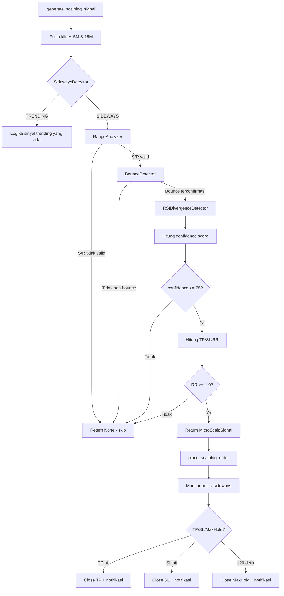

# Design Document: Sideways Micro-Scalping

## Overview

Fitur ini memperluas `ScalpingEngine` agar dapat melakukan trading secara cerdas ketika market sedang dalam kondisi sideways/ranging. Saat ini engine hanya menghasilkan sinyal berkualitas tinggi pada kondisi trending; ketika market ranging, sinyal yang dihasilkan menggunakan logika longgar tanpa validasi S/R yang solid.

Sideways Micro-Scalping menambahkan pipeline analisis khusus yang terdiri dari empat komponen baru: `SidewaysDetector`, `RangeAnalyzer`, `BounceDetector`, dan `RSIDivergenceDetector`. Pipeline ini dipanggil di dalam `generate_scalping_signal()` yang sudah ada, sehingga integrasi bersifat additive — tidak mengubah logika trending yang sudah berjalan.

Karakteristik utama strategi ini:
- Hold time maksimal **2 menit** (vs 30 menit untuk trending)
- TP di **70% jarak** menuju S/R yang berlawanan
- SL **0.15% di luar range**
- Confidence minimum **75** (vs 80 untuk trending)
- Hanya aktif di **mode Scalping (5M)**

---

## Architecture

### Alur Keputusan Utama



### Posisi Komponen dalam Codebase

```
Bismillah/app/
├── scalping_engine.py          ← Dimodifikasi: generate_scalping_signal, monitor_positions
├── sideways_detector.py        ← BARU: SidewaysDetector
├── range_analyzer.py           ← BARU: RangeAnalyzer
├── bounce_detector.py          ← BARU: BounceDetector
├── rsi_divergence_detector.py  ← BARU: RSIDivergenceDetector
└── trading_mode.py             ← Dimodifikasi: tambah MicroScalpSignal dataclass
```

---

## Components and Interfaces

### SidewaysDetector

Menentukan apakah kondisi market saat ini adalah sideways atau trending berdasarkan tiga metrik independen.

```python
class SidewaysDetector:
    def detect(
        self,
        candles_5m: list,   # 20+ candle 5M terakhir
        candles_15m: list,  # 50+ candle 15M terakhir
        price: float,
    ) -> SidewaysResult:
        ...

@dataclass
class SidewaysResult:
    is_sideways: bool
    atr_relative_pct: float   # ATR / price * 100
    ema_spread_pct: float     # |EMA21 - EMA50| / price * 100
    range_width_pct: float    # (max - min) / price * 100 dari 20 candle 5M
    reason: str               # Alasan klasifikasi untuk logging
```

**Logika klasifikasi (OR condition):**
- `atr_relative_pct < 0.3` → SIDEWAYS
- `ema_spread_pct < 0.2` → SIDEWAYS
- `range_width_pct < 1.5` → SIDEWAYS
- Jika tidak ada yang terpenuhi → TRENDING

### RangeAnalyzer

Mengidentifikasi level Support dan Resistance yang valid dari swing high/low dengan clustering.

```python
class RangeAnalyzer:
    TOLERANCE_PCT = 0.0015   # 0.15% clustering tolerance
    MIN_TOUCHES   = 2
    MIN_RANGE_PCT = 0.005    # 0.5%
    MAX_RANGE_PCT = 0.030    # 3.0%

    def analyze(
        self,
        candles_5m: list,    # 30 candle 5M terakhir
        price: float,
    ) -> Optional[RangeResult]:
        ...

@dataclass
class RangeResult:
    support: float
    resistance: float
    range_width_pct: float
    support_touches: int
    resistance_touches: int
```

**Algoritma identifikasi S/R:**
1. Kumpulkan semua swing high (high[i] > high[i-1] dan high[i] > high[i+1]) dan swing low (low[i] < low[i-1] dan low[i] < low[i+1]) dari 30 candle
2. Cluster level yang berjarak < 0.15% menjadi satu level (gunakan rata-rata harga dalam cluster)
3. Hitung jumlah candle yang menyentuh setiap cluster (high/low dalam toleransi 0.15%)
4. Pilih cluster dengan touches >= 2 sebagai level valid
5. Resistance = cluster valid tertinggi di atas harga saat ini
6. Support = cluster valid terendah di bawah harga saat ini
7. Validasi Range_Width: 0.5% ≤ width ≤ 3.0%

### BounceDetector

Mengkonfirmasi bahwa harga sedang memantul dari level S/R berdasarkan analisis wick candle terakhir.

```python
class BounceDetector:
    PROXIMITY_PCT = 0.002    # 0.2% proximity threshold

    def detect(
        self,
        last_candle: dict,   # {'open', 'high', 'low', 'close', 'volume'}
        support: float,
        resistance: float,
        price: float,
    ) -> Optional[BounceResult]:
        ...

@dataclass
class BounceResult:
    direction: str           # "LONG" atau "SHORT"
    level: float             # Level S/R yang dipantul
    wick_ratio: float        # wick_length / body_length
    reason: str              # Deskripsi untuk field reasons
```

**Algoritma wick analysis:**
```
body = |close - open|
upper_wick = high - max(open, close)
lower_wick = min(open, close) - low

Bounce dari Support (LONG):
  - price dalam 0.2% dari support: |price - support| / support < 0.002
  - lower_wick > body (wick lebih panjang dari body)

Bounce dari Resistance (SHORT):
  - price dalam 0.2% dari resistance: |price - resistance| / resistance < 0.002
  - upper_wick > body
```

### RSIDivergenceDetector

Mendeteksi divergensi antara pergerakan harga dan RSI dalam 10 candle terakhir.

```python
class RSIDivergenceDetector:
    LOOKBACK = 10

    def detect(
        self,
        candles_5m: list,    # minimal 24 candle (14 untuk RSI + 10 lookback)
        direction: str,      # "LONG" atau "SHORT"
    ) -> DivergenceResult:
        ...

@dataclass
class DivergenceResult:
    detected: bool
    divergence_type: str     # "bullish", "bearish", atau "none"
    confidence_bonus: int    # 10 jika detected, 0 jika tidak
    reason: str
```

**Algoritma divergence detection:**
```
Hitung RSI untuk setiap candle dalam lookback window (14-period RSI)

Bullish divergence (untuk sinyal LONG):
  - price_now < price_10_candles_ago (lower low)
  - rsi_now > rsi_10_candles_ago (higher low)

Bearish divergence (untuk sinyal SHORT):
  - price_now > price_10_candles_ago (higher high)
  - rsi_now < rsi_10_candles_ago (lower high)
```

### Modifikasi ScalpingEngine

Method `generate_scalping_signal()` dimodifikasi untuk memanggil pipeline sideways:

```python
async def generate_scalping_signal(self, symbol: str) -> Optional[ScalpingSignal]:
    # ... fetch klines (sudah ada) ...
    
    # BARU: Cek kondisi sideways
    sideways_result = SidewaysDetector().detect(candles_5m, candles_15m, price)
    
    if sideways_result.is_sideways:
        return await self._generate_sideways_signal(symbol, candles_5m, price, sideways_result)
    else:
        # Logika trending yang sudah ada (tidak berubah)
        return await self._generate_trending_signal(symbol, ...)

async def _generate_sideways_signal(self, ...) -> Optional[MicroScalpSignal]:
    # Panggil RangeAnalyzer → BounceDetector → RSIDivergenceDetector
    # Hitung confidence, TP/SL, RR
    # Return MicroScalpSignal atau None
```

Method `monitor_positions()` dimodifikasi untuk menangani max hold 2 menit pada posisi sideways:

```python
async def monitor_positions(self):
    for symbol, position in list(self.positions.items()):
        # Cek apakah posisi ini adalah sideways scalp
        if getattr(position, 'is_sideways', False):
            elapsed = time.time() - position.opened_at
            if elapsed > 120:  # 2 menit
                await self._close_sideways_max_hold(position)
                continue
        else:
            # Logika max hold trending 30 menit yang sudah ada
            if position.is_expired():
                await self.close_position_max_hold(position)
                continue
        # ... sisa logika TP/SL monitoring ...
```

---

## Data Models

### MicroScalpSignal Dataclass

```python
@dataclass
class MicroScalpSignal:
    # Identitas
    symbol: str
    side: str                    # "LONG" atau "SHORT"
    
    # Harga
    entry_price: float
    tp_price: float
    sl_price: float
    rr_ratio: float
    
    # Metadata range
    range_support: float
    range_resistance: float
    range_width_pct: float
    
    # Metadata analisis
    confidence: int              # 70-95
    bounce_confirmed: bool       # selalu True jika sampai sini
    rsi_divergence_detected: bool
    volume_ratio: float
    
    # Alasan sinyal
    reasons: list[str]
    
    # Marker
    is_sideways: bool = True
    max_hold_time: int = 120     # detik
```

### ScalpingPosition (Modifikasi)

Tambahkan field `is_sideways` ke dataclass `ScalpingPosition` yang sudah ada di `trading_mode.py`:

```python
@dataclass
class ScalpingPosition:
    # ... field yang sudah ada ...
    is_sideways: bool = False    # BARU: marker untuk posisi sideways
```

### Database Schema — Migration SQL

```sql
-- Migration: add_sideways_scalping_fields
-- Tambahkan field baru ke tabel autotrade_trades untuk mendukung sideways micro-scalping

ALTER TABLE public.autotrade_trades
  ADD COLUMN IF NOT EXISTS trade_type      text,
  ADD COLUMN IF NOT EXISTS trade_subtype   text,
  ADD COLUMN IF NOT EXISTS timeframe       text,
  ADD COLUMN IF NOT EXISTS tp_strategy     text,
  ADD COLUMN IF NOT EXISTS max_hold_time   integer,
  ADD COLUMN IF NOT EXISTS close_reason    text,
  ADD COLUMN IF NOT EXISTS close_price     numeric(18,8),
  ADD COLUMN IF NOT EXISTS quantity        numeric(18,8),
  -- Field khusus sideways scalping
  ADD COLUMN IF NOT EXISTS range_support          numeric(18,8),
  ADD COLUMN IF NOT EXISTS range_resistance       numeric(18,8),
  ADD COLUMN IF NOT EXISTS range_width_pct        numeric(6,4),
  ADD COLUMN IF NOT EXISTS bounce_confirmed       boolean DEFAULT false,
  ADD COLUMN IF NOT EXISTS rsi_divergence_detected boolean DEFAULT false;

-- Index untuk query analisis performa per subtype
CREATE INDEX IF NOT EXISTS idx_autotrade_trades_subtype
  ON public.autotrade_trades(trade_subtype)
  WHERE trade_subtype IS NOT NULL;
```

**Mapping field saat insert trade sideways:**

| Field | Nilai |
|---|---|
| `trade_type` | `"scalping"` |
| `trade_subtype` | `"sideways_scalp"` |
| `timeframe` | `"5m"` |
| `max_hold_time` | `120` |
| `range_support` | nilai dari RangeAnalyzer |
| `range_resistance` | nilai dari RangeAnalyzer |
| `range_width_pct` | nilai dari RangeAnalyzer |
| `bounce_confirmed` | `True` |
| `rsi_divergence_detected` | hasil dari RSIDivergenceDetector |
| `close_reason` | `"sideways_max_hold_exceeded"` / `"closed_tp"` / `"closed_sl"` |

---

## Correctness Properties

*A property is a characteristic or behavior that should hold true across all valid executions of a system — essentially, a formal statement about what the system should do. Properties serve as the bridge between human-readable specifications and machine-verifiable correctness guarantees.*

### Property 1: Klasifikasi Sideways Berdasarkan Threshold

*For any* set candle 5M dan 15M, jika salah satu dari tiga kondisi berikut terpenuhi — ATR_Relative < 0.3%, EMA_Spread < 0.2%, atau Range_Width_20candle < 1.5% — maka `SidewaysDetector.detect()` harus mengembalikan `is_sideways = True`.

**Validates: Requirements 1.2, 1.3, 1.4, 1.5**

### Property 2: Klasifikasi Trending Ketika Semua Threshold Terlampaui

*For any* set candle 5M dan 15M di mana ATR_Relative ≥ 0.3% DAN EMA_Spread ≥ 0.2% DAN Range_Width_20candle ≥ 1.5%, maka `SidewaysDetector.detect()` harus mengembalikan `is_sideways = False`.

**Validates: Requirements 1.6**

### Property 3: Clustering Level S/R dengan Toleransi 0.15%

*For any* dua level harga yang berjarak kurang dari 0.15% satu sama lain, `RangeAnalyzer` harus mengelompokkan keduanya sebagai satu level S/R yang sama (tidak menghasilkan dua level terpisah).

**Validates: Requirements 2.4**

### Property 4: Validasi Range Width

*For any* pasangan Support dan Resistance yang diidentifikasi oleh `RangeAnalyzer`, jika Range_Width < 0.5% atau Range_Width > 3.0%, maka `RangeAnalyzer.analyze()` harus mengembalikan `None`.

**Validates: Requirements 2.7, 2.8**

### Property 5: Konfirmasi Bounce Berdasarkan Wick Analysis

*For any* candle 5M terakhir dan level S/R yang valid, `BounceDetector` harus mengkonfirmasi bounce LONG jika dan hanya jika harga dalam 0.2% dari Support DAN lower_wick > body; dan mengkonfirmasi bounce SHORT jika dan hanya jika harga dalam 0.2% dari Resistance DAN upper_wick > body.

**Validates: Requirements 3.2, 3.3**

### Property 6: Deteksi RSI Divergence

*For any* window 10 candle 5M, `RSIDivergenceDetector` harus mendeteksi bullish divergence jika dan hanya jika price_now < price_10_ago DAN rsi_now > rsi_10_ago; dan mendeteksi bearish divergence jika dan hanya jika price_now > price_10_ago DAN rsi_now < rsi_10_ago.

**Validates: Requirements 4.2, 4.3**

### Property 7: Bonus Confidence dari Divergence

*For any* `MicroScalpSignal` yang dihasilkan, jika `rsi_divergence_detected = True` maka confidence score harus lebih tinggi tepat 10 poin dibandingkan sinyal yang identik tanpa divergence.

**Validates: Requirements 4.4, 4.5, 6.2**

### Property 8: Kalkulasi TP Sideways

*For any* `MicroScalpSignal` dengan arah LONG dari bounce di Support, TP harus sama dengan `entry + 0.70 * (resistance - entry)`. Untuk arah SHORT dari bounce di Resistance, TP harus sama dengan `entry - 0.70 * (entry - support)`.

**Validates: Requirements 5.1, 5.2**

### Property 9: Kalkulasi SL Sideways

*For any* `MicroScalpSignal` dengan arah LONG, SL harus sama dengan `support * (1 - 0.0015)`. Untuk arah SHORT, SL harus sama dengan `resistance * (1 + 0.0015)`.

**Validates: Requirements 5.3, 5.4**

### Property 10: Penolakan Sinyal dengan R:R < 1.0

*For any* `MicroScalpSignal` yang dihasilkan, jika `rr_ratio < 1.0` maka sinyal harus ditolak dan tidak ada order yang ditempatkan.

**Validates: Requirements 5.6**

### Property 11: Confidence Score Tidak Melebihi 95

*For any* kombinasi bonus confidence (divergence +10, volume +5, range ideal +5), confidence score final dari `MicroScalpSignal` tidak boleh melebihi 95.

**Validates: Requirements 6.5**

### Property 12: Penolakan Sinyal dengan Confidence < 75

*For any* `MicroScalpSignal` dengan confidence score akhir < 75, sinyal harus ditolak dan tidak ada order yang ditempatkan.

**Validates: Requirements 6.6**

### Property 13: Max Hold Timer Sideways

*For any* posisi sideways yang terbuka, jika elapsed time melebihi 120 detik, posisi harus ditutup dengan `close_reason = "sideways_max_hold_exceeded"`.

**Validates: Requirements 7.3, 7.4**

### Property 14: Isolasi Timer Sideways dari Trending

*For any* posisi trending yang terbuka bersamaan dengan posisi sideways, max hold timer 120 detik tidak boleh mempengaruhi posisi trending (yang menggunakan timer 1800 detik).

**Validates: Requirements 7.7**

### Property 15: Metadata Trade Sideways Lengkap

*For any* trade sideways yang disimpan ke database, record harus memiliki `trade_subtype = "sideways_scalp"` dan semua field berikut terisi: `range_support`, `range_resistance`, `range_width_pct`, `bounce_confirmed = True`, `rsi_divergence_detected`, `max_hold_time = 120`.

**Validates: Requirements 8.5, 11.1, 11.2**

### Property 16: Isolasi Mode — Sideways Hanya Aktif di Mode Scalping

*For any* user dengan `trading_mode = "swing"`, pipeline sideways (`SidewaysDetector`, `RangeAnalyzer`, `BounceDetector`, `RSIDivergenceDetector`) tidak boleh dipanggil sama sekali.

**Validates: Requirements 8.1, 8.2**

---

## Error Handling

### Strategi Graceful Degradation

Setiap komponen sideways dibungkus dalam try-except di dalam `_generate_sideways_signal()`. Kegagalan satu komponen tidak menghentikan engine.

```
SidewaysDetector exception  → log error, skip simbol, lanjut ke simbol berikutnya
RangeAnalyzer exception     → log error, return None (tidak ada sinyal)
BounceDetector exception    → log error, return None
RSIDivergenceDetector exc.  → log error, lanjut tanpa bonus divergence (confidence tetap dihitung)
DB insert gagal             → log error, posisi tetap dimonitor di memory
```

### Error Counter per Simbol

`ScalpingEngine` mempertahankan counter error sideways per simbol:

```python
self.sideways_error_counter: Dict[str, int] = {}
```

Jika counter mencapai 3 dalam satu siklus scan, simbol dimasukkan ke cooldown 5 menit menggunakan `cooldown_tracker` yang sudah ada.

### Validasi Data Candle

Sebelum memanggil komponen sideways, validasi minimum:
- `candles_5m` harus memiliki minimal 30 candle
- `candles_15m` harus memiliki minimal 50 candle
- Setiap candle harus memiliki field: `open`, `high`, `low`, `close`, `volume`

---

## Testing Strategy

### Pendekatan Dual Testing

Fitur ini menggunakan dua lapisan testing yang saling melengkapi:

1. **Unit tests** — untuk contoh spesifik, edge case, dan kondisi error
2. **Property-based tests** — untuk memverifikasi properti universal di seluruh input yang mungkin

### Library Property-Based Testing

Gunakan **`hypothesis`** (Python) sebagai library PBT:

```
pip install hypothesis
```

### Konfigurasi Property Tests

Setiap property test dikonfigurasi dengan minimal **100 iterasi**:

```python
from hypothesis import given, settings, strategies as st

@settings(max_examples=100)
@given(...)
def test_property_N_nama_property(data):
    # Feature: sideways-micro-scalping, Property N: <teks property>
    ...
```

### Unit Tests

Fokus pada:
- Contoh spesifik dengan nilai yang diketahui (misal: candle dengan ATR = 0.25% → SIDEWAYS)
- Edge case: candle dengan body = 0 (doji), volume = 0, harga identik
- Error handling: komponen yang melempar exception
- Integrasi: `generate_scalping_signal()` memanggil pipeline yang benar berdasarkan mode

### Property Tests — Implementasi

Setiap property dari bagian Correctness Properties diimplementasikan sebagai satu property-based test:

**Property 1 — Klasifikasi Sideways:**
```python
# Feature: sideways-micro-scalping, Property 1: Klasifikasi Sideways Berdasarkan Threshold
@given(
    atr_relative=st.floats(min_value=0.0, max_value=0.299),  # di bawah threshold
    ema_spread=st.floats(min_value=0.0, max_value=5.0),
    range_width=st.floats(min_value=0.0, max_value=5.0),
)
def test_sideways_when_atr_below_threshold(atr_relative, ema_spread, range_width):
    candles = build_candles_with_atr_pct(atr_relative)
    result = SidewaysDetector().detect(candles_5m=candles, ...)
    assert result.is_sideways == True
```

**Property 4 — Validasi Range Width:**
```python
# Feature: sideways-micro-scalping, Property 4: Validasi Range Width
@given(
    support=st.floats(min_value=100.0, max_value=10000.0),
    width_pct=st.one_of(
        st.floats(min_value=0.0, max_value=0.499),   # terlalu sempit
        st.floats(min_value=3.001, max_value=10.0),  # terlalu lebar
    )
)
def test_range_analyzer_rejects_invalid_width(support, width_pct):
    resistance = support * (1 + width_pct / 100)
    candles = build_candles_with_range(support, resistance)
    result = RangeAnalyzer().analyze(candles, price=support * 1.01)
    assert result is None
```

**Property 8 — Kalkulasi TP:**
```python
# Feature: sideways-micro-scalping, Property 8: Kalkulasi TP Sideways
@given(
    support=st.floats(min_value=100.0, max_value=10000.0),
    width_pct=st.floats(min_value=0.5, max_value=3.0),
)
def test_tp_calculation_long(support, width_pct):
    resistance = support * (1 + width_pct / 100)
    entry = support * 1.001  # dekat support
    expected_tp = entry + 0.70 * (resistance - entry)
    signal = build_micro_scalp_signal(side="LONG", entry=entry, support=support, resistance=resistance)
    assert abs(signal.tp_price - expected_tp) < 1e-6
```

**Property 11 — Confidence Cap:**
```python
# Feature: sideways-micro-scalping, Property 11: Confidence Score Tidak Melebihi 95
@given(
    has_divergence=st.booleans(),
    volume_ratio=st.floats(min_value=0.0, max_value=10.0),
    range_width=st.floats(min_value=0.5, max_value=3.0),
)
def test_confidence_never_exceeds_95(has_divergence, volume_ratio, range_width):
    signal = compute_confidence(base=70, has_divergence=has_divergence,
                                volume_ratio=volume_ratio, range_width=range_width)
    assert signal.confidence <= 95
```

### Struktur File Test

```
Bismillah/tests/
├── test_sideways_detector.py
├── test_range_analyzer.py
├── test_bounce_detector.py
├── test_rsi_divergence_detector.py
└── test_sideways_integration.py
```
