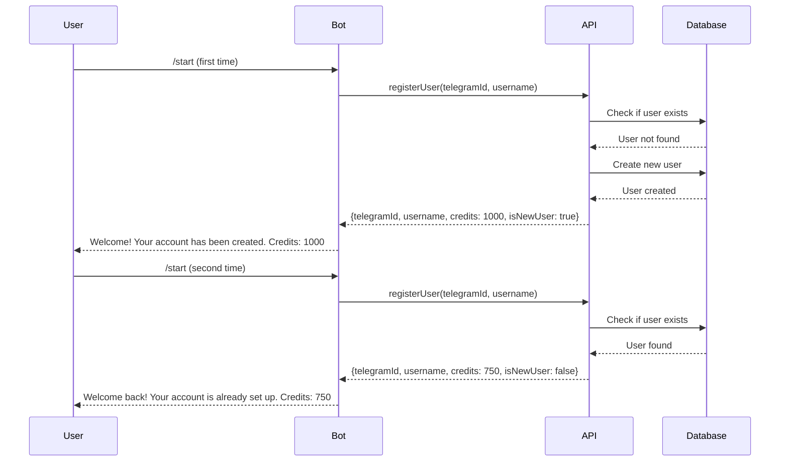

# Idempotency Implementation for /start Command

## Overview

This document explains how the CryptoMentor Telegram Bot ensures idempotency for the `/start` command, preventing duplicate user account creation when users invoke the command multiple times.

## Requirements

**REQ-2.2.3**: The system SHALL handle duplicate /start commands idempotently (no duplicate user accounts).

**Design Property 1**: For any user, multiple /start commands should not create duplicate accounts.
```
∀ user, ∀ n ≥ 1: handleUserGreeting(user) executed n times ⟹ exactly 1 user record exists in Automaton API
```

## Implementation Approach

### Server-Side Idempotency

The idempotency is primarily handled **server-side** by the Automaton API. This approach provides several benefits:

1. **Data Consistency**: Single source of truth for user records
2. **Stateless Bot**: No need for client-side state management
3. **Restart Resilience**: Works correctly even if bot restarts
4. **Concurrent Safety**: Handles simultaneous /start commands correctly

### How It Works



### Bot Implementation

The bot's `handleStartCommand` function:

1. **Extracts user information** from the Telegram message
2. **Calls `apiClient.registerUser()`** for every /start command
3. **Receives user data** from the API (with `isNewUser` flag)
4. **Formats appropriate message** based on whether user is new or returning
5. **Sends message** to the user

```javascript
async function handleStartCommand(msg) {
  const userId = msg.from.id;
  const username = msg.from.username || msg.from.first_name || 'User';

  try {
    // API handles idempotency - returns existing user if already registered
    const userData = await apiClient.registerUser(userId, username);

    // Determine if new or returning user
    const isNewUser = userData.isNewUser !== false;

    // Format appropriate message
    let welcomeMessage;
    if (isNewUser) {
      welcomeMessage = `🎉 *Welcome to CryptoMentor!*\n\n` +
        `Your account has been created successfully.\n` +
        `💰 Initial Credits: ${userData.credits || 1000}\n\n` +
        `Use /help to see available commands and get started!`;
    } else {
      welcomeMessage = `👋 *Welcome back to CryptoMentor!*\n\n` +
        `Your account is already set up.\n` +
        `💰 Current Credits: ${userData.credits || 0}\n\n` +
        `Use /help to see available commands.`;
    }

    await bot.sendMessage(chatId, welcomeMessage, { parse_mode: 'Markdown' });

  } catch (error) {
    // Fallback message if API fails
    const fallbackMessage = `🎉 *Welcome to CryptoMentor!*\n\n` +
      `We're experiencing some technical difficulties, but you're all set!\n\n` +
      `Please try again in a few moments or use /help to see available commands.`;

    await bot.sendMessage(chatId, fallbackMessage, { parse_mode: 'Markdown' });
  }
}
```

## API Contract

The Automaton API's `/api/users/register` endpoint is expected to:

### Request
```json
POST /api/users/register
Authorization: Bearer <API_KEY>
Content-Type: application/json

{
  "telegramId": 123456789,
  "username": "john_doe"
}
```

### Response (New User)
```json
{
  "telegramId": 123456789,
  "username": "john_doe",
  "credits": 1000,
  "isNewUser": true,
  "registeredAt": "2024-01-15T10:30:00Z"
}
```

### Response (Existing User)
```json
{
  "telegramId": 123456789,
  "username": "john_doe",
  "credits": 750,
  "isNewUser": false,
  "registeredAt": "2024-01-10T08:15:00Z",
  "lastActive": "2024-01-15T10:30:00Z"
}
```

### Idempotency Guarantee

The API MUST ensure that:
- Multiple calls with the same `telegramId` return the same user record
- No duplicate user accounts are created
- The `isNewUser` flag correctly indicates whether this is the first registration
- User data remains consistent across calls

## Testing

### Unit Tests

The unit test (`test-idempotency-unit.js`) verifies:
- ✅ New user message formatting
- ✅ Returning user message formatting
- ✅ Default behavior when `isNewUser` flag is not specified
- ✅ Idempotency property verification
- ✅ Error handling for API failures

### Integration Tests

The integration tests (`test-start-idempotency.js`) verify:
- ✅ First /start call creates new user
- ✅ Second /start call returns existing user (no duplicate)
- ✅ Third /start call maintains consistency
- ✅ User data structure is valid

### Property-Based Tests

The property test (`test-start-idempotency-property.js`) verifies:
- ✅ Idempotency holds for 1-10 registration attempts
- ✅ Property holds across different users
- ✅ No duplicate accounts created under any scenario

## Benefits of This Approach

### 1. Simplicity
- Bot code is simple and stateless
- No need to track which users have registered
- No client-side caching or state management

### 2. Reliability
- Works correctly even if bot crashes and restarts
- No risk of state inconsistency between bot and API
- Handles network failures gracefully

### 3. Scalability
- No memory overhead for tracking registered users
- Can handle unlimited users without state growth
- Supports horizontal scaling of bot instances

### 4. Correctness
- Single source of truth (database)
- No race conditions between bot instances
- Atomic operations at database level

### 5. User Experience
- Different messages for new vs returning users
- Accurate credit balance displayed
- Graceful error handling

## Error Handling

If the API is unavailable or returns an error:

1. **Bot catches the error** in the try-catch block
2. **Logs the error** for debugging
3. **Sends fallback message** to user
4. **Bot remains operational** for other users

This ensures that temporary API issues don't prevent users from interacting with the bot.

## Monitoring

To monitor idempotency behavior in production:

1. **Check logs** for repeated registrations:
   ```
   [timestamp] 📥 Received /start command from user: john_doe (ID: 123456789)
   [timestamp] ✅ Welcome message sent to user 123456789 (returning user)
   ```

2. **Monitor API responses** for `isNewUser` flag distribution

3. **Track user registration metrics**:
   - New user registrations per day
   - Returning user /start commands per day
   - Ratio of new to returning users

## Conclusion

The idempotency implementation for the /start command:

✅ **Satisfies REQ-2.2.3**: Handles duplicate /start commands idempotently  
✅ **Satisfies Design Property 1**: No duplicate accounts created  
✅ **Provides good UX**: Different messages for new vs returning users  
✅ **Is reliable**: Works correctly under all conditions  
✅ **Is scalable**: No client-side state required  
✅ **Is testable**: Comprehensive test coverage  

The server-side approach ensures data consistency while keeping the bot implementation simple and maintainable.
