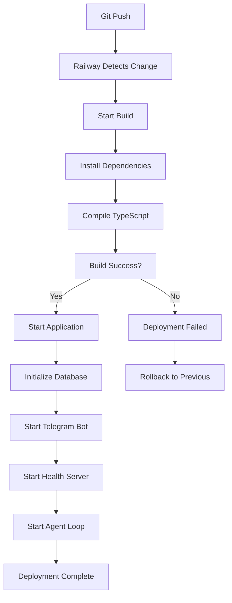

# Design Document: Railway Deployment untuk Automaton

## Overview

Design ini menjelaskan implementasi deployment Automaton ke platform Railway dengan fokus pada:

1. **Build System Configuration**: Setup pnpm monorepo dengan TypeScript compilation
2. **Database Persistence**: SQLite database dengan Railway volumes untuk data persistence
3. **Environment Management**: Secure environment variables configuration
4. **Application Lifecycle**: Graceful startup, shutdown, dan health monitoring
5. **Payment Authorization System**: Manual approval workflow untuk financial transactions
6. **Telegram Bot Interface**: Remote monitoring dan control via Telegram

Automaton adalah autonomous AI agent runtime yang berjalan kontinyu dengan agent loop dan heartbeat daemon. Deployment ke Railway memerlukan konfigurasi khusus untuk:
- Native module compilation (better-sqlite3)
- Long-running process management
- Volume-based database persistence
- Health check endpoints untuk Railway monitoring
- Telegram bot untuk remote management

## Architecture

### High-Level Architecture

```
┌─────────────────────────────────────────────────────────────┐
│                      Railway Platform                        │
│  ┌───────────────────────────────────────────────────────┐  │
│  │                  Automaton Service                     │  │
│  │  ┌──────────────┐  ┌──────────────┐  ┌─────────────┐ │  │
│  │  │ Agent Loop   │  │  Heartbeat   │  │  HTTP       │ │  │
│  │  │ (Main)       │  │  Daemon      │  │  Server     │ │  │
│  │  └──────┬───────┘  └──────┬───────┘  └─────┬───────┘ │  │
│  │         │                  │                 │         │  │
│  │         └──────────────────┴─────────────────┘         │  │
│  │                            │                            │  │
│  │                   ┌────────▼────────┐                  │  │
│  │                   │  SQLite DB      │                  │  │
│  │                   │  (Volume)       │                  │  │
│  │                   └─────────────────┘                  │  │
│  └───────────────────────────────────────────────────────┘  │
│                              │                               │
│                              │ Telegram Bot API              │
└──────────────────────────────┼───────────────────────────────┘
                               │
                    ┌──────────▼──────────┐
                    │   Telegram Bot      │
                    │   (node-telegram-   │
                    │    bot-api)         │
                    └──────────┬──────────┘
                               │
                    ┌──────────▼──────────┐
                    │  Creator/Owner      │
                    │  (Telegram User)    │
                    └─────────────────────┘
```


### Component Interaction Flow

1. **Startup Flow**:
   - Railway starts container dengan Node.js 20+
   - Build system runs: `pnpm install` → `pnpm build` → `node dist/index.js --run`
   - Application initializes database dari Railway volume
   - Telegram bot connects ke Telegram API
   - Health endpoint starts listening pada Railway PORT
   - Heartbeat daemon starts
   - Agent loop begins

2. **Payment Request Flow**:
   - Agent loop detects need untuk transfer_credits
   - Payment request disimpan ke database dengan status "pending_approval"
   - Telegram bot sends notification ke creator dengan inline buttons
   - Creator clicks approve/reject atau uses command `/approve <id>` atau `/reject <id>`
   - System executes atau cancels payment based on approval
   - Audit trail logged ke database

3. **Monitoring Flow**:
   - Creator sends `/status` command via Telegram
   - Bot queries database untuk system state
   - Bot responds dengan formatted status message
   - Health endpoint responds ke Railway health checks

## Technology Stack

### Core Dependencies

- **Runtime**: Node.js 20.0.0+
- **Package Manager**: pnpm (workspace monorepo)
- **Language**: TypeScript 5.9+
- **Database**: SQLite (better-sqlite3 v11.0.0)
- **Telegram Bot**: node-telegram-bot-api v0.66.0
- **HTTP Server**: Node.js built-in http module

### Railway-Specific

- **Build System**: Nixpacks (Railway default)
- **Volume**: Railway persistent volume untuk SQLite database
- **Environment**: Railway environment variables
- **Health Check**: HTTP endpoint pada Railway PORT


## Components and Interfaces

### 1. Railway Configuration (Requirement 1)

#### railway.json

Configuration file untuk Railway deployment settings:

```json
{
  "$schema": "https://railway.app/railway.schema.json",
  "build": {
    "builder": "NIXPACKS",
    "buildCommand": "pnpm install --frozen-lockfile && pnpm build"
  },
  "deploy": {
    "startCommand": "node dist/index.js --run",
    "healthcheckPath": "/health",
    "healthcheckTimeout": 300,
    "restartPolicyType": "ON_FAILURE",
    "restartPolicyMaxRetries": 10
  }
}
```

#### nixpacks.toml

Nixpacks configuration untuk native module compilation:

```toml
[phases.setup]
nixPkgs = ["nodejs-20_x", "pnpm", "python3", "gcc", "gnumake"]

[phases.install]
cmds = ["pnpm install --frozen-lockfile"]

[phases.build]
cmds = ["pnpm build"]

[start]
cmd = "node dist/index.js --run"
```

#### Build Process

1. **Install Phase**: 
   - Install pnpm dependencies dengan frozen lockfile
   - Compile native modules (better-sqlite3) dengan node-gyp
   - Install production dependencies only

2. **Build Phase**:
   - Run TypeScript compiler: `tsc`
   - Build all workspace packages: `pnpm -r build`
   - Generate dist/ directory dengan compiled JavaScript

3. **Start Phase**:
   - Execute: `node dist/index.js --run`
   - Application starts dengan Railway environment variables


### 2. Environment Variables Management (Requirement 2)

#### Environment Variables Schema

```typescript
interface RailwayEnvironment {
  // Railway-provided
  PORT: string;                    // HTTP port untuk health check
  RAILWAY_ENVIRONMENT: string;     // "production" | "staging"
  RAILWAY_VOLUME_MOUNT_PATH: string; // Path ke persistent volume
  
  // Automaton-specific
  DB_PATH: string;                 // SQLite database path (di volume)
  LOG_LEVEL: "debug" | "info" | "warn" | "error";
  CONWAY_API_URL: string;
  CONWAY_API_KEY: string;
  INFERENCE_MODEL: string;
  MAX_TOKENS_PER_TURN: string;
  
  // Telegram Bot
  TELEGRAM_BOT_TOKEN: string;      // Bot token dari @BotFather
  TELEGRAM_CREATOR_ID: string;     // Telegram user ID creator
  
  // Payment Authorization
  PAYMENT_AUTO_APPROVE_THRESHOLD: string; // Optional: auto-approve di bawah threshold (cents)
  PAYMENT_RATE_LIMIT_PER_HOUR: string;    // Optional: max payment requests per hour
}
```

#### Environment Configuration Module

File: `src/railway/environment.ts`

```typescript
export interface RailwayConfig {
  port: number;
  environment: string;
  volumePath: string;
  dbPath: string;
  logLevel: "debug" | "info" | "warn" | "error";
  telegram?: {
    botToken: string;
    creatorId: string;
  };
  payment: {
    autoApproveThreshold: number; // cents
    rateLimitPerHour: number;
  };
}

export function loadRailwayConfig(): RailwayConfig {
  const port = parseInt(process.env.PORT || "3000", 10);
  const volumePath = process.env.RAILWAY_VOLUME_MOUNT_PATH || "/data";
  const dbPath = process.env.DB_PATH || `${volumePath}/automaton.db`;
  
  return {
    port,
    environment: process.env.RAILWAY_ENVIRONMENT || "production",
    volumePath,
    dbPath,
    logLevel: (process.env.LOG_LEVEL as any) || "info",
    telegram: process.env.TELEGRAM_BOT_TOKEN ? {
      botToken: process.env.TELEGRAM_BOT_TOKEN,
      creatorId: process.env.TELEGRAM_CREATOR_ID || "",
    } : undefined,
    payment: {
      autoApproveThreshold: parseInt(process.env.PAYMENT_AUTO_APPROVE_THRESHOLD || "0", 10),
      rateLimitPerHour: parseInt(process.env.PAYMENT_RATE_LIMIT_PER_HOUR || "10", 10),
    },
  };
}
```


### 3. Health Check dan HTTP Server (Requirement 6)

#### Health Check Endpoint

File: `src/railway/health-server.ts`

```typescript
import http from "http";
import type { AutomatonDatabase } from "../types.js";

export interface HealthStatus {
  status: "healthy" | "unhealthy";
  timestamp: string;
  uptime: number;
  agent: {
    state: string;
    turnCount: number;
  };
  database: {
    connected: boolean;
  };
  telegram?: {
    connected: boolean;
  };
}

export function createHealthServer(
  port: number,
  db: AutomatonDatabase,
  telegramBot?: any
): http.Server {
  const startTime = Date.now();
  
  const server = http.createServer((req, res) => {
    if (req.url === "/health" && req.method === "GET") {
      try {
        const state = db.getAgentState();
        const turnCount = db.getTurnCount();
        
        const health: HealthStatus = {
          status: "healthy",
          timestamp: new Date().toISOString(),
          uptime: Math.floor((Date.now() - startTime) / 1000),
          agent: {
            state,
            turnCount,
          },
          database: {
            connected: true,
          },
        };
        
        if (telegramBot) {
          health.telegram = {
            connected: telegramBot.isPolling(),
          };
        }
        
        // Unhealthy jika agent dead
        if (state === "dead") {
          health.status = "unhealthy";
          res.writeHead(503, { "Content-Type": "application/json" });
        } else {
          res.writeHead(200, { "Content-Type": "application/json" });
        }
        
        res.end(JSON.stringify(health, null, 2));
      } catch (error: any) {
        res.writeHead(503, { "Content-Type": "application/json" });
        res.end(JSON.stringify({
          status: "unhealthy",
          error: error.message,
          timestamp: new Date().toISOString(),
        }));
      }
    } else {
      res.writeHead(404, { "Content-Type": "text/plain" });
      res.end("Not Found");
    }
  });
  
  return server;
}
```


### 4. Payment Authorization System (Requirement 11)

#### Database Schema Changes

Tambahan table untuk payment approvals:

```sql
CREATE TABLE IF NOT EXISTS payment_requests (
  id TEXT PRIMARY KEY,
  to_address TEXT NOT NULL,
  amount_cents INTEGER NOT NULL,
  note TEXT,
  status TEXT NOT NULL, -- 'pending_approval', 'approved', 'rejected', 'executed', 'failed'
  requested_at TEXT NOT NULL,
  reviewed_at TEXT,
  reviewed_by TEXT, -- Telegram user ID
  rejection_reason TEXT,
  execution_result TEXT,
  executed_at TEXT,
  created_at TEXT DEFAULT (datetime('now'))
);

CREATE INDEX IF NOT EXISTS idx_payment_requests_status ON payment_requests(status);
CREATE INDEX IF NOT EXISTS idx_payment_requests_requested_at ON payment_requests(requested_at);
```

#### Payment Request Interface

File: `src/payment/approval.ts`

```typescript
export interface PaymentRequest {
  id: string;
  toAddress: string;
  amountCents: number;
  note?: string;
  status: PaymentStatus;
  requestedAt: string;
  reviewedAt?: string;
  reviewedBy?: string;
  rejectionReason?: string;
  executionResult?: string;
  executedAt?: string;
}

export type PaymentStatus = 
  | "pending_approval" 
  | "approved" 
  | "rejected" 
  | "executed" 
  | "failed";

export interface PaymentApprovalSystem {
  requestPayment(toAddress: string, amountCents: number, note?: string): Promise<PaymentRequest>;
  approvePayment(requestId: string, reviewedBy: string): Promise<void>;
  rejectPayment(requestId: string, reviewedBy: string, reason: string): Promise<void>;
  executeApprovedPayments(): Promise<void>;
  getPendingRequests(): PaymentRequest[];
  getRequestById(id: string): PaymentRequest | undefined;
  checkRateLimit(): boolean;
}
```

#### Implementation

```typescript
export function createPaymentApprovalSystem(
  db: AutomatonDatabase,
  conway: ConwayClient,
  config: { autoApproveThreshold: number; rateLimitPerHour: number }
): PaymentApprovalSystem {
  
  async function requestPayment(
    toAddress: string, 
    amountCents: number, 
    note?: string
  ): Promise<PaymentRequest> {
    // Check rate limit
    if (!checkRateLimit()) {
      throw new Error("Payment rate limit exceeded");
    }
    
    const id = ulid();
    const request: PaymentRequest = {
      id,
      toAddress,
      amountCents,
      note,
      status: "pending_approval",
      requestedAt: new Date().toISOString(),
    };
    
    // Auto-approve jika di bawah threshold
    if (config.autoApproveThreshold > 0 && amountCents <= config.autoApproveThreshold) {
      request.status = "approved";
      request.reviewedAt = new Date().toISOString();
      request.reviewedBy = "auto";
    }
    
    db.insertPaymentRequest(request);
    
    // Log audit trail
    db.insertTransaction({
      id: ulid(),
      type: "payment_request",
      amountCents,
      description: `Payment request to ${toAddress}: ${note || "no note"}`,
      timestamp: new Date().toISOString(),
    });
    
    return request;
  }
  
  async function approvePayment(requestId: string, reviewedBy: string): Promise<void> {
    const request = db.getPaymentRequestById(requestId);
    if (!request) throw new Error("Payment request not found");
    if (request.status !== "pending_approval") {
      throw new Error(`Cannot approve payment in status: ${request.status}`);
    }
    
    db.updatePaymentRequest(requestId, {
      status: "approved",
      reviewedAt: new Date().toISOString(),
      reviewedBy,
    });
  }
  
  async function rejectPayment(
    requestId: string, 
    reviewedBy: string, 
    reason: string
  ): Promise<void> {
    const request = db.getPaymentRequestById(requestId);
    if (!request) throw new Error("Payment request not found");
    if (request.status !== "pending_approval") {
      throw new Error(`Cannot reject payment in status: ${request.status}`);
    }
    
    db.updatePaymentRequest(requestId, {
      status: "rejected",
      reviewedAt: new Date().toISOString(),
      reviewedBy,
      rejectionReason: reason,
    });
    
    // Log rejection
    db.insertTransaction({
      id: ulid(),
      type: "payment_rejected",
      amountCents: request.amountCents,
      description: `Payment rejected: ${reason}`,
      timestamp: new Date().toISOString(),
    });
  }
  
  async function executeApprovedPayments(): Promise<void> {
    const approved = db.getPaymentRequestsByStatus("approved");
    
    for (const request of approved) {
      try {
        const result = await conway.transferCredits(
          request.toAddress,
          request.amountCents,
          request.note
        );
        
        db.updatePaymentRequest(request.id, {
          status: "executed",
          executionResult: JSON.stringify(result),
          executedAt: new Date().toISOString(),
        });
        
        // Log successful transfer
        db.insertTransaction({
          id: ulid(),
          type: "transfer_out",
          amountCents: request.amountCents,
          balanceAfterCents: result.balanceAfterCents,
          description: `Transfer to ${request.toAddress}: ${request.note || ""}`,
          timestamp: new Date().toISOString(),
        });
      } catch (error: any) {
        db.updatePaymentRequest(request.id, {
          status: "failed",
          executionResult: error.message,
          executedAt: new Date().toISOString(),
        });
      }
    }
  }
  
  function getPendingRequests(): PaymentRequest[] {
    return db.getPaymentRequestsByStatus("pending_approval");
  }
  
  function getRequestById(id: string): PaymentRequest | undefined {
    return db.getPaymentRequestById(id);
  }
  
  function checkRateLimit(): boolean {
    const oneHourAgo = new Date(Date.now() - 60 * 60 * 1000).toISOString();
    const recentRequests = db.getPaymentRequestsSince(oneHourAgo);
    return recentRequests.length < config.rateLimitPerHour;
  }
  
  return {
    requestPayment,
    approvePayment,
    rejectPayment,
    executeApprovedPayments,
    getPendingRequests,
    getRequestById,
    checkRateLimit,
  };
}
```


### 5. Telegram Bot Interface (Requirement 12)

#### Telegram Bot Configuration

File: `src/telegram/bot.ts`

```typescript
import TelegramBot from "node-telegram-bot-api";
import type { AutomatonDatabase } from "../types.js";
import type { PaymentApprovalSystem } from "../payment/approval.js";

export interface TelegramBotConfig {
  token: string;
  creatorId: string;
  db: AutomatonDatabase;
  paymentSystem: PaymentApprovalSystem;
}

export function createTelegramBot(config: TelegramBotConfig): TelegramBot {
  const bot = new TelegramBot(config.token, { polling: true });
  
  // Store creator chat ID
  const creatorId = config.creatorId;
  
  // Authentication middleware
  function isAuthorized(msg: TelegramBot.Message): boolean {
    return msg.from?.id.toString() === creatorId;
  }
  
  // Command: /start
  bot.onText(/\/start/, async (msg) => {
    if (!isAuthorized(msg)) return;
    
    await bot.sendMessage(msg.chat.id, 
      "🤖 Automaton Control Bot\n\n" +
      "Available commands:\n" +
      "/status - System synopsis\n" +
      "/logs - Recent logs\n" +
      "/approve <id> - Approve payment\n" +
      "/reject <id> <reason> - Reject payment\n" +
      "/fund <amount> - Fund automaton\n" +
      "/children - List child agents\n" +
      "/help - Show this help"
    );
  });
  
  // Command: /status
  bot.onText(/\/status/, async (msg) => {
    if (!isAuthorized(msg)) return;
    
    try {
      const state = config.db.getAgentState();
      const turnCount = config.db.getTurnCount();
      const identity = {
        name: config.db.getIdentity("name"),
        address: config.db.getIdentity("address"),
      };
      
      // Get financial state
      const recentTxns = config.db.getRecentTransactions(1);
      const lastBalance = recentTxns[0]?.balanceAfterCents || 0;
      
      // Get uptime
      const firstTurn = config.db.getRecentTurns(1)[0];
      const uptimeMs = firstTurn ? Date.now() - new Date(firstTurn.timestamp).getTime() : 0;
      const uptimeHours = Math.floor(uptimeMs / (1000 * 60 * 60));
      
      const statusMsg = 
        `📊 *System Status*\n\n` +
        `Name: ${identity.name}\n` +
        `Address: \`${identity.address}\`\n` +
        `State: ${state}\n` +
        `Turns: ${turnCount}\n` +
        `Balance: $${(lastBalance / 100).toFixed(2)}\n` +
        `Uptime: ${uptimeHours}h\n`;
      
      await bot.sendMessage(msg.chat.id, statusMsg, { parse_mode: "Markdown" });
    } catch (error: any) {
      await bot.sendMessage(msg.chat.id, `❌ Error: ${error.message}`);
    }
  });
  
  // Command: /logs
  bot.onText(/\/logs/, async (msg) => {
    if (!isAuthorized(msg)) return;
    
    try {
      const turns = config.db.getRecentTurns(5);
      
      let logsMsg = "📝 *Recent Logs*\n\n";
      for (const turn of turns) {
        const time = new Date(turn.timestamp).toLocaleTimeString();
        logsMsg += `[${time}] ${turn.state}\n`;
        logsMsg += `  Tools: ${turn.toolCalls.length}\n`;
        logsMsg += `  Tokens: ${turn.tokenUsage.totalTokens}\n\n`;
      }
      
      await bot.sendMessage(msg.chat.id, logsMsg, { parse_mode: "Markdown" });
    } catch (error: any) {
      await bot.sendMessage(msg.chat.id, `❌ Error: ${error.message}`);
    }
  });
  
  // Command: /approve <id>
  bot.onText(/\/approve (.+)/, async (msg, match) => {
    if (!isAuthorized(msg)) return;
    
    const requestId = match?.[1];
    if (!requestId) {
      await bot.sendMessage(msg.chat.id, "Usage: /approve <payment_id>");
      return;
    }
    
    try {
      await config.paymentSystem.approvePayment(requestId, creatorId);
      await bot.sendMessage(msg.chat.id, `✅ Payment ${requestId} approved`);
      
      // Execute approved payments
      await config.paymentSystem.executeApprovedPayments();
    } catch (error: any) {
      await bot.sendMessage(msg.chat.id, `❌ Error: ${error.message}`);
    }
  });
  
  // Command: /reject <id> <reason>
  bot.onText(/\/reject (\S+) (.+)/, async (msg, match) => {
    if (!isAuthorized(msg)) return;
    
    const requestId = match?.[1];
    const reason = match?.[2];
    
    if (!requestId || !reason) {
      await bot.sendMessage(msg.chat.id, "Usage: /reject <payment_id> <reason>");
      return;
    }
    
    try {
      await config.paymentSystem.rejectPayment(requestId, creatorId, reason);
      await bot.sendMessage(msg.chat.id, `❌ Payment ${requestId} rejected`);
    } catch (error: any) {
      await bot.sendMessage(msg.chat.id, `❌ Error: ${error.message}`);
    }
  });
  
  // Command: /children
  bot.onText(/\/children/, async (msg) => {
    if (!isAuthorized(msg)) return;
    
    try {
      const children = config.db.getChildren();
      
      if (children.length === 0) {
        await bot.sendMessage(msg.chat.id, "No child agents");
        return;
      }
      
      let childrenMsg = "👶 *Child Agents*\n\n";
      for (const child of children) {
        childrenMsg += `${child.name}\n`;
        childrenMsg += `  Status: ${child.status}\n`;
        childrenMsg += `  Address: \`${child.address}\`\n\n`;
      }
      
      await bot.sendMessage(msg.chat.id, childrenMsg, { parse_mode: "Markdown" });
    } catch (error: any) {
      await bot.sendMessage(msg.chat.id, `❌ Error: ${error.message}`);
    }
  });
  
  // Callback query handler untuk inline buttons
  bot.on("callback_query", async (query) => {
    if (!query.from || query.from.id.toString() !== creatorId) return;
    if (!query.data) return;
    
    const [action, requestId] = query.data.split(":");
    
    try {
      if (action === "approve") {
        await config.paymentSystem.approvePayment(requestId, creatorId);
        await bot.answerCallbackQuery(query.id, { text: "Payment approved" });
        await bot.editMessageReplyMarkup({ inline_keyboard: [] }, {
          chat_id: query.message!.chat.id,
          message_id: query.message!.message_id,
        });
        
        // Execute
        await config.paymentSystem.executeApprovedPayments();
      } else if (action === "reject") {
        await config.paymentSystem.rejectPayment(requestId, creatorId, "Rejected via button");
        await bot.answerCallbackQuery(query.id, { text: "Payment rejected" });
        await bot.editMessageReplyMarkup({ inline_keyboard: [] }, {
          chat_id: query.message!.chat.id,
          message_id: query.message!.message_id,
        });
      }
    } catch (error: any) {
      await bot.answerCallbackQuery(query.id, { text: `Error: ${error.message}` });
    }
  });
  
  return bot;
}

// Notification helper
export async function notifyPaymentRequest(
  bot: TelegramBot,
  creatorChatId: string,
  request: PaymentRequest
): Promise<void> {
  const message = 
    `💰 *Payment Request*\n\n` +
    `To: \`${request.toAddress}\`\n` +
    `Amount: $${(request.amountCents / 100).toFixed(2)}\n` +
    `Note: ${request.note || "none"}\n` +
    `ID: \`${request.id}\``;
  
  const keyboard = {
    inline_keyboard: [
      [
        { text: "✅ Approve", callback_data: `approve:${request.id}` },
        { text: "❌ Reject", callback_data: `reject:${request.id}` },
      ],
    ],
  };
  
  await bot.sendMessage(creatorChatId, message, {
    parse_mode: "Markdown",
    reply_markup: keyboard,
  });
}
```


### 6. Application Lifecycle Management (Requirement 5)

#### Railway Entry Point

File: `src/railway/index.ts`

```typescript
import { loadRailwayConfig } from "./environment.js";
import { createHealthServer } from "./health-server.js";
import { createTelegramBot, notifyPaymentRequest } from "../telegram/bot.js";
import { createPaymentApprovalSystem } from "../payment/approval.js";
import { createDatabase } from "../state/database.js";
import { loadConfig } from "../config.js";
import { getWallet } from "../identity/wallet.js";
import { createConwayClient } from "../conway/client.js";
import { createInferenceClient } from "../conway/inference.js";
import { runAgentLoop } from "../agent/loop.js";

export async function runOnRailway(): Promise<void> {
  console.log(`[${new Date().toISOString()}] Starting Automaton on Railway...`);
  
  // Load Railway-specific config
  const railwayConfig = loadRailwayConfig();
  console.log(`[${new Date().toISOString()}] Railway environment: ${railwayConfig.environment}`);
  console.log(`[${new Date().toISOString()}] Database path: ${railwayConfig.dbPath}`);
  
  // Load automaton config
  const config = loadConfig();
  if (!config) {
    throw new Error("Automaton not configured. Run setup first.");
  }
  
  // Override DB path dengan Railway volume path
  config.dbPath = railwayConfig.dbPath;
  config.logLevel = railwayConfig.logLevel;
  
  // Initialize database
  const db = createDatabase(config.dbPath);
  console.log(`[${new Date().toISOString()}] Database initialized`);
  
  // Load wallet
  const { account } = await getWallet();
  
  // Create Conway client
  const conway = createConwayClient({
    apiUrl: config.conwayApiUrl,
    apiKey: config.conwayApiKey,
    sandboxId: config.sandboxId,
  });
  
  // Create inference client
  const inference = createInferenceClient({
    apiUrl: config.conwayApiUrl,
    apiKey: config.conwayApiKey,
    defaultModel: config.inferenceModel,
    maxTokens: config.maxTokensPerTurn,
  });
  
  // Create payment approval system
  const paymentSystem = createPaymentApprovalSystem(db, conway, {
    autoApproveThreshold: railwayConfig.payment.autoApproveThreshold,
    rateLimitPerHour: railwayConfig.payment.rateLimitPerHour,
  });
  
  // Create Telegram bot (optional)
  let telegramBot: TelegramBot | undefined;
  let creatorChatId: string | undefined;
  
  if (railwayConfig.telegram) {
    telegramBot = createTelegramBot({
      token: railwayConfig.telegram.botToken,
      creatorId: railwayConfig.telegram.creatorId,
      db,
      paymentSystem,
    });
    
    // Get creator chat ID (sama dengan user ID untuk private chats)
    creatorChatId = railwayConfig.telegram.creatorId;
    
    console.log(`[${new Date().toISOString()}] Telegram bot started`);
  }
  
  // Start health check server
  const healthServer = createHealthServer(railwayConfig.port, db, telegramBot);
  healthServer.listen(railwayConfig.port, () => {
    console.log(`[${new Date().toISOString()}] Health server listening on port ${railwayConfig.port}`);
  });
  
  // Graceful shutdown handler
  const shutdown = async () => {
    console.log(`[${new Date().toISOString()}] Shutting down...`);
    
    if (telegramBot) {
      await telegramBot.stopPolling();
    }
    
    healthServer.close();
    db.setAgentState("sleeping");
    db.close();
    
    process.exit(0);
  };
  
  process.on("SIGTERM", shutdown);
  process.on("SIGINT", shutdown);
  
  // Payment request notification hook
  const originalRequestPayment = paymentSystem.requestPayment.bind(paymentSystem);
  paymentSystem.requestPayment = async (toAddress, amountCents, note) => {
    const request = await originalRequestPayment(toAddress, amountCents, note);
    
    // Notify via Telegram jika pending approval
    if (request.status === "pending_approval" && telegramBot && creatorChatId) {
      await notifyPaymentRequest(telegramBot, creatorChatId, request);
    }
    
    return request;
  };
  
  // Main agent loop (simplified untuk Railway)
  console.log(`[${new Date().toISOString()}] Starting agent loop...`);
  
  while (true) {
    try {
      await runAgentLoop({
        identity: {
          name: config.name,
          address: account.address,
          account,
          creatorAddress: config.creatorAddress,
          sandboxId: config.sandboxId,
          apiKey: config.conwayApiKey,
          createdAt: new Date().toISOString(),
        },
        config,
        db,
        conway,
        inference,
        paymentSystem, // Pass payment system ke agent loop
        onStateChange: (state) => {
          console.log(`[${new Date().toISOString()}] State: ${state}`);
        },
        onTurnComplete: (turn) => {
          console.log(`[${new Date().toISOString()}] Turn ${turn.id}: ${turn.toolCalls.length} tools`);
        },
      });
      
      // Sleep between loops
      await new Promise(resolve => setTimeout(resolve, 60000));
    } catch (error: any) {
      console.error(`[${new Date().toISOString()}] Error in agent loop: ${error.message}`);
      await new Promise(resolve => setTimeout(resolve, 30000));
    }
  }
}
```

#### Modified src/index.ts

Tambahkan Railway mode detection:

```typescript
// Di dalam main() function, tambahkan:
if (process.env.RAILWAY_ENVIRONMENT) {
  const { runOnRailway } = await import("./railway/index.js");
  await runOnRailway();
  return;
}
```


### 7. Logging Configuration (Requirement 7)

#### Structured Logger

File: `src/railway/logger.ts`

```typescript
export type LogLevel = "debug" | "info" | "warn" | "error";

export interface LogEntry {
  timestamp: string;
  level: LogLevel;
  message: string;
  context?: Record<string, any>;
  error?: {
    message: string;
    stack?: string;
  };
}

export class RailwayLogger {
  private level: LogLevel;
  private levels: Record<LogLevel, number> = {
    debug: 0,
    info: 1,
    warn: 2,
    error: 3,
  };
  
  constructor(level: LogLevel = "info") {
    this.level = level;
  }
  
  private shouldLog(level: LogLevel): boolean {
    return this.levels[level] >= this.levels[this.level];
  }
  
  private log(level: LogLevel, message: string, context?: Record<string, any>, error?: Error): void {
    if (!this.shouldLog(level)) return;
    
    const entry: LogEntry = {
      timestamp: new Date().toISOString(),
      level,
      message,
      context,
    };
    
    if (error) {
      entry.error = {
        message: error.message,
        stack: error.stack,
      };
    }
    
    // Output ke stdout sebagai JSON untuk Railway log aggregation
    console.log(JSON.stringify(entry));
  }
  
  debug(message: string, context?: Record<string, any>): void {
    this.log("debug", message, context);
  }
  
  info(message: string, context?: Record<string, any>): void {
    this.log("info", message, context);
  }
  
  warn(message: string, context?: Record<string, any>): void {
    this.log("warn", message, context);
  }
  
  error(message: string, error?: Error, context?: Record<string, any>): void {
    this.log("error", message, context, error);
  }
  
  // Lifecycle events
  logStartup(config: any): void {
    this.info("Automaton starting", {
      environment: config.environment,
      dbPath: config.dbPath,
      port: config.port,
    });
  }
  
  logShutdown(): void {
    this.info("Automaton shutting down");
  }
  
  logDatabaseInit(path: string): void {
    this.info("Database initialized", { path });
  }
  
  logStateChange(from: string, to: string): void {
    this.info("State change", { from, to });
  }
  
  logTurn(turnId: string, toolCount: number, tokens: number): void {
    this.info("Turn completed", {
      turnId,
      toolCount,
      tokens,
    });
  }
  
  logPaymentRequest(requestId: string, amount: number, toAddress: string): void {
    this.info("Payment request created", {
      requestId,
      amountCents: amount,
      toAddress,
    });
  }
  
  logPaymentApproval(requestId: string, reviewedBy: string): void {
    this.info("Payment approved", {
      requestId,
      reviewedBy,
    });
  }
  
  logPaymentRejection(requestId: string, reviewedBy: string, reason: string): void {
    this.warn("Payment rejected", {
      requestId,
      reviewedBy,
      reason,
    });
  }
}

export function createLogger(level: LogLevel = "info"): RailwayLogger {
  return new RailwayLogger(level);
}
```


## Data Models

### Database Schema Extensions

#### Payment Requests Table

```sql
CREATE TABLE IF NOT EXISTS payment_requests (
  id TEXT PRIMARY KEY,
  to_address TEXT NOT NULL,
  amount_cents INTEGER NOT NULL,
  note TEXT,
  status TEXT NOT NULL CHECK(status IN ('pending_approval', 'approved', 'rejected', 'executed', 'failed')),
  requested_at TEXT NOT NULL,
  reviewed_at TEXT,
  reviewed_by TEXT,
  rejection_reason TEXT,
  execution_result TEXT,
  executed_at TEXT,
  created_at TEXT DEFAULT (datetime('now'))
);

CREATE INDEX IF NOT EXISTS idx_payment_requests_status ON payment_requests(status);
CREATE INDEX IF NOT EXISTS idx_payment_requests_requested_at ON payment_requests(requested_at);
```

#### Telegram Configuration Table

```sql
CREATE TABLE IF NOT EXISTS telegram_config (
  key TEXT PRIMARY KEY,
  value TEXT NOT NULL,
  updated_at TEXT DEFAULT (datetime('now'))
);

-- Store creator chat ID untuk notifications
INSERT OR IGNORE INTO telegram_config (key, value) VALUES ('creator_chat_id', '');
```

#### Database Interface Extensions

Tambahan methods untuk `AutomatonDatabase`:

```typescript
interface AutomatonDatabase {
  // ... existing methods ...
  
  // Payment requests
  insertPaymentRequest(request: PaymentRequest): void;
  updatePaymentRequest(id: string, updates: Partial<PaymentRequest>): void;
  getPaymentRequestById(id: string): PaymentRequest | undefined;
  getPaymentRequestsByStatus(status: PaymentStatus): PaymentRequest[];
  getPaymentRequestsSince(timestamp: string): PaymentRequest[];
  
  // Telegram config
  getTelegramConfig(key: string): string | undefined;
  setTelegramConfig(key: string, value: string): void;
}
```

### TypeScript Interfaces

#### PaymentRequest

```typescript
export interface PaymentRequest {
  id: string;
  toAddress: string;
  amountCents: number;
  note?: string;
  status: PaymentStatus;
  requestedAt: string;
  reviewedAt?: string;
  reviewedBy?: string;
  rejectionReason?: string;
  executionResult?: string;
  executedAt?: string;
}

export type PaymentStatus = 
  | "pending_approval" 
  | "approved" 
  | "rejected" 
  | "executed" 
  | "failed";
```

#### RailwayConfig

```typescript
export interface RailwayConfig {
  port: number;
  environment: string;
  volumePath: string;
  dbPath: string;
  logLevel: "debug" | "info" | "warn" | "error";
  telegram?: {
    botToken: string;
    creatorId: string;
  };
  payment: {
    autoApproveThreshold: number;
    rateLimitPerHour: number;
  };
}
```


## API and Interface Design

### Telegram Bot Commands

#### Command Interface

```typescript
interface TelegramCommand {
  command: string;
  description: string;
  usage: string;
  handler: (msg: TelegramBot.Message, args?: string[]) => Promise<void>;
}
```

#### Available Commands

1. **/start** - Initialize bot dan show help
   - No arguments
   - Returns: Welcome message dengan command list

2. **/status** - Get system synopsis
   - No arguments
   - Returns: JSON-formatted status (state, turns, balance, uptime)

3. **/logs** - Get recent logs
   - Optional: `count` (default: 20)
   - Returns: Last N log entries

4. **/approve <payment_id>** - Approve pending payment
   - Required: `payment_id`
   - Returns: Confirmation message
   - Side effect: Executes approved payment

5. **/reject <payment_id> <reason>** - Reject pending payment
   - Required: `payment_id`, `reason`
   - Returns: Confirmation message
   - Side effect: Logs rejection

6. **/fund <amount>** - Request funding
   - Required: `amount` (in USD)
   - Returns: Funding instructions
   - Note: Placeholder untuk future implementation

7. **/children** - List child agents
   - No arguments
   - Returns: List of child agents dengan status

8. **/help** - Show command help
   - No arguments
   - Returns: Command list dengan descriptions

#### Inline Keyboard Callbacks

```typescript
interface CallbackData {
  action: "approve" | "reject";
  requestId: string;
}

// Format: "action:requestId"
// Example: "approve:01HQXYZ123"
```

### Health Check API

#### GET /health

Response format:

```typescript
interface HealthResponse {
  status: "healthy" | "unhealthy";
  timestamp: string;
  uptime: number; // seconds
  agent: {
    state: AgentState;
    turnCount: number;
  };
  database: {
    connected: boolean;
  };
  telegram?: {
    connected: boolean;
  };
}
```

Status codes:
- 200: Healthy
- 503: Unhealthy (agent dead atau database error)
- 404: Invalid endpoint


## Security Considerations

### 1. Environment Variables Security

- **Sensitive Data**: API keys, bot tokens disimpan sebagai Railway environment variables
- **Access Control**: Environment variables hanya accessible oleh Railway service
- **No Hardcoding**: Tidak ada credentials di source code atau config files
- **Validation**: Validate semua environment variables saat startup

### 2. Telegram Bot Authentication

- **Creator ID Verification**: Setiap command verify Telegram user ID
- **No Public Access**: Bot hanya responds ke authorized creator
- **Token Security**: Bot token stored sebagai environment variable
- **Rate Limiting**: Implement rate limiting untuk prevent abuse

### 3. Payment Authorization Security

- **Manual Approval Required**: Default behavior memerlukan manual approval
- **Audit Trail**: Semua payment requests logged dengan timestamps
- **Rate Limiting**: Maximum N payment requests per hour
- **Rejection Logging**: Rejection reasons logged untuk audit
- **Auto-Approve Threshold**: Optional, configurable, default 0 (disabled)

### 4. Database Security

- **Volume Permissions**: Railway volume dengan proper file permissions
- **No External Access**: Database hanya accessible dari application
- **WAL Mode**: Write-Ahead Logging untuk data integrity
- **Foreign Keys**: Enabled untuk referential integrity

### 5. API Security

- **Health Endpoint Only**: Hanya expose /health endpoint
- **No Sensitive Data**: Health response tidak contain credentials
- **Error Handling**: Generic error messages, no stack traces exposed

### 6. Injection Defense

- **Input Sanitization**: Sanitize semua user input dari Telegram
- **SQL Injection**: Use prepared statements untuk database queries
- **Command Injection**: Validate command arguments
- **XSS Prevention**: Escape output dalam Telegram messages


## Deployment Flow

### Initial Setup

1. **Railway Project Creation**
   - Create new Railway project
   - Connect GitHub repository
   - Configure automatic deployments

2. **Volume Setup**
   - Create Railway volume untuk database persistence
   - Mount path: `/data`
   - Size: 1GB (minimum)

3. **Environment Variables Configuration**
   ```bash
   # Required
   CONWAY_API_KEY=<api_key>
   CONWAY_API_URL=https://api.conway.tech
   DB_PATH=/data/automaton.db
   
   # Optional - Telegram
   TELEGRAM_BOT_TOKEN=<bot_token>
   TELEGRAM_CREATOR_ID=<telegram_user_id>
   
   # Optional - Payment
   PAYMENT_AUTO_APPROVE_THRESHOLD=0
   PAYMENT_RATE_LIMIT_PER_HOUR=10
   
   # Optional - Logging
   LOG_LEVEL=info
   ```

4. **Initial Deployment**
   - Push code ke GitHub
   - Railway automatically triggers build
   - Build process: install → compile → start
   - Application starts dan initializes database

### Deployment Process



### Build Steps Detail

1. **Phase: Setup**
   ```bash
   # Nixpacks installs system dependencies
   - nodejs-20_x
   - pnpm
   - python3 (untuk node-gyp)
   - gcc, gnumake (untuk native modules)
   ```

2. **Phase: Install**
   ```bash
   pnpm install --frozen-lockfile
   # Installs:
   # - All workspace dependencies
   # - Compiles better-sqlite3 native module
   # - Installs node-telegram-bot-api
   ```

3. **Phase: Build**
   ```bash
   pnpm build
   # Runs:
   # - tsc (compile TypeScript)
   # - pnpm -r build (build all workspace packages)
   # Output: dist/ directory
   ```

4. **Phase: Start**
   ```bash
   node dist/index.js --run
   # Application starts dengan Railway environment
   ```

### Health Check Configuration

Railway health check settings:
- **Path**: `/health`
- **Timeout**: 300 seconds
- **Interval**: 60 seconds
- **Restart Policy**: ON_FAILURE
- **Max Retries**: 10

### Rollback Procedure

1. **Automatic Rollback**
   - Railway automatically rollback jika health check fails
   - Previous deployment restored

2. **Manual Rollback**
   ```bash
   # Via Railway CLI
   railway rollback
   
   # Via Railway Dashboard
   # Deployments → Select previous deployment → Redeploy
   ```

### Monitoring

1. **Railway Dashboard**
   - View logs (stdout/stderr)
   - Monitor resource usage (CPU, memory)
   - Check deployment status

2. **Telegram Bot**
   - `/status` untuk real-time status
   - `/logs` untuk recent activity
   - Automatic notifications untuk payment requests

3. **Health Endpoint**
   - Railway automatically monitors `/health`
   - External monitoring dapat query endpoint


## Configuration Files

### 1. railway.json

Location: `railway.json` (project root)

```json
{
  "$schema": "https://railway.app/railway.schema.json",
  "build": {
    "builder": "NIXPACKS",
    "buildCommand": "pnpm install --frozen-lockfile && pnpm build"
  },
  "deploy": {
    "startCommand": "node dist/index.js --run",
    "healthcheckPath": "/health",
    "healthcheckTimeout": 300,
    "restartPolicyType": "ON_FAILURE",
    "restartPolicyMaxRetries": 10
  }
}
```

### 2. nixpacks.toml

Location: `nixpacks.toml` (project root)

```toml
[phases.setup]
nixPkgs = ["nodejs-20_x", "pnpm", "python3", "gcc", "gnumake"]

[phases.install]
cmds = ["pnpm install --frozen-lockfile"]

[phases.build]
cmds = ["pnpm build"]

[start]
cmd = "node dist/index.js --run"
```

### 3. .railwayignore

Location: `.railwayignore` (project root)

```
# Development files
node_modules/
.git/
.kiro/

# Test files
**/__tests__/
*.test.ts
*.spec.ts
vitest.config.ts

# Documentation
*.md
!README.md

# Local config
.env
.env.local
```

### 4. package.json Updates

Add Railway-specific scripts:

```json
{
  "scripts": {
    "build": "tsc && pnpm -r build",
    "start": "node dist/index.js --run",
    "railway:build": "pnpm install --frozen-lockfile && pnpm build",
    "railway:start": "node dist/index.js --run"
  },
  "dependencies": {
    "node-telegram-bot-api": "^0.66.0"
  },
  "devDependencies": {
    "@types/node-telegram-bot-api": "^0.64.0"
  }
}
```

### 5. Environment Variables Template

Location: `.env.example`

```bash
# Railway Environment (auto-provided)
PORT=3000
RAILWAY_ENVIRONMENT=production
RAILWAY_VOLUME_MOUNT_PATH=/data

# Database
DB_PATH=/data/automaton.db

# Conway API
CONWAY_API_URL=https://api.conway.tech
CONWAY_API_KEY=your_api_key_here

# Inference
INFERENCE_MODEL=gpt-4o
MAX_TOKENS_PER_TURN=4096

# Logging
LOG_LEVEL=info

# Telegram Bot (optional)
TELEGRAM_BOT_TOKEN=your_bot_token_here
TELEGRAM_CREATOR_ID=your_telegram_user_id

# Payment Authorization (optional)
PAYMENT_AUTO_APPROVE_THRESHOLD=0
PAYMENT_RATE_LIMIT_PER_HOUR=10
```

### 6. TypeScript Configuration Updates

No changes needed - existing `tsconfig.json` sudah compatible dengan Railway.


## Environment Variables Reference

### Required Variables

| Variable | Description | Example | Source |
|----------|-------------|---------|--------|
| `PORT` | HTTP server port | `3000` | Railway (auto) |
| `RAILWAY_ENVIRONMENT` | Deployment environment | `production` | Railway (auto) |
| `RAILWAY_VOLUME_MOUNT_PATH` | Volume mount path | `/data` | Railway (auto) |
| `DB_PATH` | SQLite database path | `/data/automaton.db` | User |
| `CONWAY_API_KEY` | Conway API key | `sk_...` | User |
| `CONWAY_API_URL` | Conway API URL | `https://api.conway.tech` | User |

### Optional Variables

| Variable | Description | Default | Example |
|----------|-------------|---------|---------|
| `LOG_LEVEL` | Logging level | `info` | `debug` |
| `INFERENCE_MODEL` | LLM model | `gpt-4o` | `gpt-4o-mini` |
| `MAX_TOKENS_PER_TURN` | Max tokens per turn | `4096` | `8192` |
| `TELEGRAM_BOT_TOKEN` | Telegram bot token | - | `123456:ABC-DEF...` |
| `TELEGRAM_CREATOR_ID` | Creator Telegram ID | - | `123456789` |
| `PAYMENT_AUTO_APPROVE_THRESHOLD` | Auto-approve threshold (cents) | `0` | `50` |
| `PAYMENT_RATE_LIMIT_PER_HOUR` | Payment rate limit | `10` | `20` |

### Variable Validation

Application validates environment variables saat startup:

```typescript
function validateEnvironment(): void {
  const required = [
    "CONWAY_API_KEY",
    "CONWAY_API_URL",
  ];
  
  for (const key of required) {
    if (!process.env[key]) {
      throw new Error(`Missing required environment variable: ${key}`);
    }
  }
  
  // Validate Telegram config jika provided
  if (process.env.TELEGRAM_BOT_TOKEN && !process.env.TELEGRAM_CREATOR_ID) {
    throw new Error("TELEGRAM_CREATOR_ID required when TELEGRAM_BOT_TOKEN is set");
  }
  
  // Validate numeric values
  if (process.env.PORT && isNaN(parseInt(process.env.PORT))) {
    throw new Error("PORT must be a number");
  }
}
```


## Correctness Properties

*A property is a characteristic or behavior that should hold true across all valid executions of a system—essentially, a formal statement about what the system should do. Properties serve as the bridge between human-readable specifications and machine-verifiable correctness guarantees.*

### Property Reflection

Setelah menganalisis semua acceptance criteria, beberapa properties dapat digabungkan untuk menghindari redundancy:

- Properties untuk environment variable validation dapat digabungkan menjadi satu comprehensive property
- Properties untuk payment request lifecycle dapat digabungkan untuk cover full flow
- Properties untuk Telegram command handling dapat digabungkan untuk cover authentication dan execution

### Properties

#### Property 1: Environment Variable Fallback

*For any* optional environment variable yang tidak di-set, system harus menggunakan safe default value dan tidak crash saat startup.

**Validates: Requirements 2.4**

#### Property 2: TypeScript Compilation Completeness

*For any* package dalam monorepo, build process harus menghasilkan compiled JavaScript files di dist/ directory dengan corresponding .d.ts type definitions.

**Validates: Requirements 1.2**

#### Property 3: Database Initialization Idempotency

*For any* valid database path, jika database file tidak exists, system harus create it; jika sudah exists, system harus open dan use it tanpa recreate atau corrupt existing data.

**Validates: Requirements 4.2, 4.3**

#### Property 4: Database Path Error Handling

*For any* invalid atau inaccessible database path, system harus throw error dengan clear message yang menjelaskan problem (e.g., "Volume not mounted", "Permission denied").

**Validates: Requirements 4.5**

#### Property 5: Graceful Shutdown Cleanup

*For any* shutdown trigger (SIGTERM, SIGINT), system harus cleanup resources dalam order: stop heartbeat → close database → exit process.

**Validates: Requirements 5.4, 5.5**

#### Property 6: Health Check Status Accuracy

*For any* agent state, health endpoint harus return status code 200 jika state bukan "dead", dan 503 jika state adalah "dead".

**Validates: Requirements 6.2, 6.4**

#### Property 7: Structured Logging Format

*For any* log entry generated oleh RailwayLogger, output harus be valid JSON dengan required fields: timestamp, level, message.

**Validates: Requirements 7.2**

#### Property 8: Error Logging Completeness

*For any* error yang di-log, log entry harus contain error.message dan error.stack (jika available).

**Validates: Requirements 7.3**

#### Property 9: Payment Request Creation

*For any* transfer_credits attempt, system harus create payment request dalam database dengan status "pending_approval" (atau "approved" jika amount <= auto-approve threshold).

**Validates: Requirements 11.1, 11.2, 11.7**

#### Property 10: Payment Rejection Handling

*For any* rejected payment request, system harus set status to "rejected", log rejection reason, dan tidak retry automatically.

**Validates: Requirements 11.4**

#### Property 11: Payment Approval Execution

*For any* approved payment request, system harus call conway.transferCredits, update status to "executed" atau "failed", dan log transaction details.

**Validates: Requirements 11.5**

#### Property 12: Payment Notification

*For any* new payment request dengan status "pending_approval", system harus send Telegram notification ke creator (jika Telegram configured).

**Validates: Requirements 11.6, 12.8**

#### Property 13: Payment Audit Trail

*For any* payment request lifecycle event (create, approve, reject, execute), system harus create corresponding transaction log entry dalam database.

**Validates: Requirements 11.9**

#### Property 14: Payment Rate Limiting

*For any* one-hour time window, system harus reject payment requests jika count exceeds configured rate limit.

**Validates: Requirements 11.10**

#### Property 15: Payment Approval Required in All States

*For any* agent state including "critical", payment requests harus require manual approval (kecuali amount <= auto-approve threshold).

**Validates: Requirements 11.8**

#### Property 16: Telegram Authentication

*For any* incoming Telegram message, system harus verify sender ID matches configured creator ID sebelum processing command.

**Validates: Requirements 12.2**

#### Property 17: Telegram Optional Feature

*For any* missing TELEGRAM_BOT_TOKEN environment variable, system harus start successfully tanpa Telegram bot features dan tidak crash.

**Validates: Requirements 12.13**

#### Property 18: Critical State Alert

*For any* state change ke "critical", system harus send alert notification via Telegram (jika configured).

**Validates: Requirements 12.9**


## Error Handling

### 1. Environment Configuration Errors

**Scenario**: Missing required environment variables

```typescript
class EnvironmentError extends Error {
  constructor(variable: string) {
    super(`Missing required environment variable: ${variable}`);
    this.name = "EnvironmentError";
  }
}

// Validation saat startup
function validateEnvironment(): void {
  const required = ["CONWAY_API_KEY", "CONWAY_API_URL"];
  
  for (const key of required) {
    if (!process.env[key]) {
      throw new EnvironmentError(key);
    }
  }
}
```

**Recovery**: Application exits dengan error code 1. User harus set environment variables dan redeploy.

### 2. Database Errors

**Scenario**: Volume not mounted atau database corruption

```typescript
class DatabaseError extends Error {
  constructor(message: string, public readonly path: string) {
    super(`Database error at ${path}: ${message}`);
    this.name = "DatabaseError";
  }
}

// Error handling dalam createDatabase
try {
  const db = new Database(dbPath);
} catch (error: any) {
  if (error.code === "ENOENT") {
    throw new DatabaseError("Volume not mounted or path does not exist", dbPath);
  } else if (error.code === "SQLITE_CORRUPT") {
    throw new DatabaseError("Database file is corrupted", dbPath);
  }
  throw error;
}
```

**Recovery**: 
- Volume not mounted: Check Railway volume configuration
- Corruption: Restore dari backup atau recreate database

### 3. Telegram Bot Errors

**Scenario**: Invalid bot token atau network errors

```typescript
class TelegramError extends Error {
  constructor(message: string) {
    super(`Telegram bot error: ${message}`);
    this.name = "TelegramError";
  }
}

// Error handling dalam bot initialization
try {
  const bot = new TelegramBot(token, { polling: true });
  
  bot.on("polling_error", (error) => {
    logger.error("Telegram polling error", error);
    // Continue running without Telegram
  });
} catch (error: any) {
  if (error.code === "ETELEGRAM") {
    throw new TelegramError("Invalid bot token");
  }
  // Log error but continue without Telegram
  logger.warn("Telegram bot initialization failed, continuing without Telegram", { error: error.message });
}
```

**Recovery**: Application continues running tanpa Telegram features. User dapat fix token dan redeploy.

### 4. Payment Execution Errors

**Scenario**: Transfer credits fails (insufficient balance, network error)

```typescript
async function executeApprovedPayments(): Promise<void> {
  const approved = db.getPaymentRequestsByStatus("approved");
  
  for (const request of approved) {
    try {
      const result = await conway.transferCredits(
        request.toAddress,
        request.amountCents,
        request.note
      );
      
      db.updatePaymentRequest(request.id, {
        status: "executed",
        executionResult: JSON.stringify(result),
        executedAt: new Date().toISOString(),
      });
    } catch (error: any) {
      // Log error dan mark as failed
      logger.error("Payment execution failed", error, {
        requestId: request.id,
        toAddress: request.toAddress,
        amountCents: request.amountCents,
      });
      
      db.updatePaymentRequest(request.id, {
        status: "failed",
        executionResult: error.message,
        executedAt: new Date().toISOString(),
      });
      
      // Notify creator via Telegram
      if (telegramBot && creatorChatId) {
        await telegramBot.sendMessage(
          creatorChatId,
          `❌ Payment execution failed\nID: ${request.id}\nError: ${error.message}`
        );
      }
    }
  }
}
```

**Recovery**: Payment marked as "failed". Creator dapat review error dan retry manually atau adjust amount.

### 5. Health Check Errors

**Scenario**: Database query fails during health check

```typescript
const server = http.createServer((req, res) => {
  if (req.url === "/health") {
    try {
      const state = db.getAgentState();
      const turnCount = db.getTurnCount();
      
      // Return health status
      res.writeHead(200, { "Content-Type": "application/json" });
      res.end(JSON.stringify({ status: "healthy", ... }));
    } catch (error: any) {
      // Return unhealthy status
      logger.error("Health check failed", error);
      
      res.writeHead(503, { "Content-Type": "application/json" });
      res.end(JSON.stringify({
        status: "unhealthy",
        error: "Database query failed",
        timestamp: new Date().toISOString(),
      }));
    }
  }
});
```

**Recovery**: Railway detects unhealthy status dan dapat restart container jika configured.

### 6. Build Errors

**Scenario**: TypeScript compilation fails atau native module build fails

```bash
# Build command dalam railway.json
"buildCommand": "pnpm install --frozen-lockfile && pnpm build"

# Jika fails:
# - TypeScript errors: Fix type errors dalam code
# - Native module errors: Check nixpacks.toml has required system dependencies
# - Dependency errors: Check pnpm-lock.yaml is committed
```

**Recovery**: Fix errors dan push new commit. Railway automatically triggers new build.

### Error Logging Strategy

Semua errors logged dengan structured format:

```typescript
logger.error("Operation failed", error, {
  operation: "payment_execution",
  requestId: "01HQXYZ123",
  context: { ... },
});

// Output:
{
  "timestamp": "2024-01-15T10:30:00.000Z",
  "level": "error",
  "message": "Operation failed",
  "context": {
    "operation": "payment_execution",
    "requestId": "01HQXYZ123"
  },
  "error": {
    "message": "Insufficient balance",
    "stack": "Error: Insufficient balance\n    at ..."
  }
}
```


## Testing Strategy

### Dual Testing Approach

Testing strategy menggunakan kombinasi unit tests dan property-based tests untuk comprehensive coverage:

- **Unit tests**: Verify specific examples, edge cases, dan error conditions
- **Property tests**: Verify universal properties across all inputs
- Both are complementary and necessary

### Unit Testing

Unit tests focus pada:

1. **Specific Examples**
   - Railway config loading dengan valid environment variables
   - Health endpoint returns correct status untuk specific agent states
   - Telegram command handlers process specific commands correctly
   - Payment approval/rejection untuk specific request IDs

2. **Edge Cases**
   - Empty atau whitespace environment variables
   - Database path dengan special characters
   - Telegram messages dari unauthorized users
   - Payment requests dengan zero atau negative amounts

3. **Error Conditions**
   - Missing required environment variables
   - Invalid database paths
   - Network errors dalam Telegram bot
   - Payment execution failures

4. **Integration Points**
   - Database initialization sequence
   - Health server startup
   - Telegram bot initialization
   - Payment system integration dengan Conway client

### Property-Based Testing

Property tests configured dengan minimum 100 iterations per test untuk ensure comprehensive input coverage.

#### Test Configuration

```typescript
import { describe, it, expect } from "vitest";
import fc from "fast-check";

// Configure property test iterations
const PROPERTY_TEST_ITERATIONS = 100;

describe("Railway Deployment Properties", () => {
  it("Property 1: Environment Variable Fallback", () => {
    fc.assert(
      fc.property(
        fc.record({
          PORT: fc.option(fc.nat(), { nil: undefined }),
          LOG_LEVEL: fc.option(fc.constantFrom("debug", "info", "warn", "error"), { nil: undefined }),
          PAYMENT_AUTO_APPROVE_THRESHOLD: fc.option(fc.nat(), { nil: undefined }),
        }),
        (env) => {
          // Test implementation
          const config = loadRailwayConfig(env);
          
          // Should not crash
          expect(config).toBeDefined();
          
          // Should have safe defaults
          expect(config.port).toBeGreaterThan(0);
          expect(config.logLevel).toMatch(/^(debug|info|warn|error)$/);
          expect(config.payment.autoApproveThreshold).toBeGreaterThanOrEqual(0);
        }
      ),
      { numRuns: PROPERTY_TEST_ITERATIONS }
    );
  });
});
```

#### Property Test Tags

Each property test MUST include comment tag referencing design document:

```typescript
/**
 * Feature: railway-deployment, Property 1: Environment Variable Fallback
 * 
 * For any optional environment variable yang tidak di-set, system harus 
 * menggunakan safe default value dan tidak crash saat startup.
 */
it("Property 1: Environment Variable Fallback", () => { ... });
```

### Test Organization

```
src/
├── railway/
│   ├── __tests__/
│   │   ├── environment.test.ts          # Unit tests untuk environment config
│   │   ├── environment.property.test.ts # Property tests untuk environment
│   │   ├── health-server.test.ts        # Unit tests untuk health endpoint
│   │   ├── health-server.property.test.ts
│   │   └── logger.test.ts
│   ├── environment.ts
│   ├── health-server.ts
│   └── logger.ts
├── payment/
│   ├── __tests__/
│   │   ├── approval.test.ts             # Unit tests untuk payment system
│   │   └── approval.property.test.ts    # Property tests untuk payment
│   └── approval.ts
└── telegram/
    ├── __tests__/
    │   ├── bot.test.ts                  # Unit tests untuk Telegram bot
    │   └── bot.property.test.ts         # Property tests untuk bot
    └── bot.ts
```

### Property Test Examples

#### Property 3: Database Initialization Idempotency

```typescript
/**
 * Feature: railway-deployment, Property 3: Database Initialization Idempotency
 */
it("Property 3: Database Initialization Idempotency", () => {
  fc.assert(
    fc.property(
      fc.string().filter(s => s.length > 0 && !s.includes('\0')),
      (dbPath) => {
        const fullPath = `/tmp/test-${dbPath}.db`;
        
        // First initialization
        const db1 = createDatabase(fullPath);
        db1.setKV("test", "value1");
        const value1 = db1.getKV("test");
        db1.close();
        
        // Second initialization (should reuse existing)
        const db2 = createDatabase(fullPath);
        const value2 = db2.getKV("test");
        db2.close();
        
        // Should preserve data
        expect(value2).toBe(value1);
        
        // Cleanup
        fs.unlinkSync(fullPath);
      }
    ),
    { numRuns: PROPERTY_TEST_ITERATIONS }
  );
});
```

#### Property 9: Payment Request Creation

```typescript
/**
 * Feature: railway-deployment, Property 9: Payment Request Creation
 */
it("Property 9: Payment Request Creation", () => {
  fc.assert(
    fc.property(
      fc.string().filter(s => s.startsWith("0x") && s.length === 42), // Valid address
      fc.nat({ max: 100000 }), // Amount in cents
      fc.option(fc.string(), { nil: undefined }), // Optional note
      fc.nat({ max: 100 }), // Auto-approve threshold
      async (toAddress, amountCents, note, threshold) => {
        const paymentSystem = createPaymentApprovalSystem(db, conway, {
          autoApproveThreshold: threshold,
          rateLimitPerHour: 100,
        });
        
        const request = await paymentSystem.requestPayment(toAddress, amountCents, note);
        
        // Should create request
        expect(request).toBeDefined();
        expect(request.toAddress).toBe(toAddress);
        expect(request.amountCents).toBe(amountCents);
        
        // Should have correct status based on threshold
        if (amountCents <= threshold && threshold > 0) {
          expect(request.status).toBe("approved");
        } else {
          expect(request.status).toBe("pending_approval");
        }
      }
    ),
    { numRuns: PROPERTY_TEST_ITERATIONS }
  );
});
```

#### Property 16: Telegram Authentication

```typescript
/**
 * Feature: railway-deployment, Property 16: Telegram Authentication
 */
it("Property 16: Telegram Authentication", () => {
  fc.assert(
    fc.property(
      fc.string(), // Random user ID
      fc.constantFrom("/status", "/logs", "/approve", "/reject"), // Commands
      (userId, command) => {
        const creatorId = "123456789";
        const isAuthorized = userId === creatorId;
        
        const msg = {
          from: { id: parseInt(userId) },
          chat: { id: 123 },
          text: command,
        };
        
        // Mock bot handler
        let commandExecuted = false;
        const handler = (msg: any) => {
          if (msg.from?.id.toString() === creatorId) {
            commandExecuted = true;
          }
        };
        
        handler(msg);
        
        // Should only execute for authorized user
        expect(commandExecuted).toBe(isAuthorized);
      }
    ),
    { numRuns: PROPERTY_TEST_ITERATIONS }
  );
});
```

### Test Execution

```bash
# Run all tests
pnpm test

# Run unit tests only
pnpm test --grep -v "Property"

# Run property tests only
pnpm test --grep "Property"

# Run tests untuk specific module
pnpm test src/railway/__tests__/

# Run with coverage
pnpm test --coverage
```

### Coverage Goals

- **Unit Test Coverage**: Minimum 80% line coverage
- **Property Test Coverage**: All correctness properties implemented
- **Integration Test Coverage**: Critical paths (startup, shutdown, payment flow)


## Implementation Notes

### 1. Dependency Installation

Tambahkan dependencies baru ke package.json:

```bash
pnpm add node-telegram-bot-api
pnpm add -D @types/node-telegram-bot-api
```

### 2. File Structure

New files yang perlu dibuat:

```
src/
├── railway/
│   ├── index.ts              # Railway entry point
│   ├── environment.ts        # Environment config loader
│   ├── health-server.ts      # Health check HTTP server
│   └── logger.ts             # Structured logger
├── payment/
│   └── approval.ts           # Payment approval system
├── telegram/
│   └── bot.ts                # Telegram bot implementation
└── state/
    └── schema.ts             # Database schema updates (add payment_requests table)
```

### 3. Database Migration

Add migration untuk payment_requests table:

```typescript
// src/state/schema.ts
export const MIGRATION_V4 = `
CREATE TABLE IF NOT EXISTS payment_requests (
  id TEXT PRIMARY KEY,
  to_address TEXT NOT NULL,
  amount_cents INTEGER NOT NULL,
  note TEXT,
  status TEXT NOT NULL CHECK(status IN ('pending_approval', 'approved', 'rejected', 'executed', 'failed')),
  requested_at TEXT NOT NULL,
  reviewed_at TEXT,
  reviewed_by TEXT,
  rejection_reason TEXT,
  execution_result TEXT,
  executed_at TEXT,
  created_at TEXT DEFAULT (datetime('now'))
);

CREATE INDEX IF NOT EXISTS idx_payment_requests_status ON payment_requests(status);
CREATE INDEX IF NOT EXISTS idx_payment_requests_requested_at ON payment_requests(requested_at);

CREATE TABLE IF NOT EXISTS telegram_config (
  key TEXT PRIMARY KEY,
  value TEXT NOT NULL,
  updated_at TEXT DEFAULT (datetime('now'))
);

INSERT INTO schema_version (version, applied_at) VALUES (4, datetime('now'));
`;
```

### 4. Environment Detection

Modify src/index.ts untuk detect Railway environment:

```typescript
async function main(): Promise<void> {
  // ... existing CLI handling ...
  
  if (args.includes("--run")) {
    // Check if running on Railway
    if (process.env.RAILWAY_ENVIRONMENT) {
      const { runOnRailway } = await import("./railway/index.js");
      await runOnRailway();
      return;
    }
    
    // Otherwise run normal mode
    await run();
    return;
  }
}
```

### 5. Payment System Integration

Modify agent loop untuk use payment approval system:

```typescript
// src/agent/loop.ts
export async function runAgentLoop(context: {
  // ... existing params ...
  paymentSystem?: PaymentApprovalSystem;
}) {
  // ... existing code ...
  
  // When agent wants to transfer credits:
  if (context.paymentSystem) {
    // Use approval system instead of direct transfer
    const request = await context.paymentSystem.requestPayment(
      toAddress,
      amountCents,
      note
    );
    
    // Wait for approval (check in next loop iteration)
    return;
  } else {
    // Direct transfer (local mode)
    await context.conway.transferCredits(toAddress, amountCents, note);
  }
}
```

### 6. Telegram Bot Setup

Steps untuk setup Telegram bot:

1. **Create Bot**:
   - Message @BotFather on Telegram
   - Send `/newbot`
   - Follow prompts untuk set name dan username
   - Save bot token

2. **Get Creator ID**:
   - Message @userinfobot on Telegram
   - Bot will reply dengan your user ID
   - Save this ID

3. **Configure Railway**:
   - Add environment variables:
     - `TELEGRAM_BOT_TOKEN=<your_bot_token>`
     - `TELEGRAM_CREATOR_ID=<your_user_id>`

4. **Test Bot**:
   - Deploy to Railway
   - Message your bot on Telegram
   - Send `/start` untuk verify connection

### 7. Volume Configuration

Railway volume setup:

1. **Create Volume**:
   - Railway Dashboard → Project → Volumes
   - Click "New Volume"
   - Name: `automaton-data`
   - Size: 1GB
   - Mount path: `/data`

2. **Verify Mount**:
   - Check logs untuk "Database initialized" message
   - Verify DB_PATH points to `/data/automaton.db`

### 8. Testing Locally

Test Railway-specific code locally:

```bash
# Set environment variables
export RAILWAY_ENVIRONMENT=development
export RAILWAY_VOLUME_MOUNT_PATH=/tmp/railway-test
export PORT=3000
export DB_PATH=/tmp/railway-test/automaton.db
export TELEGRAM_BOT_TOKEN=<your_token>
export TELEGRAM_CREATOR_ID=<your_id>

# Create test volume directory
mkdir -p /tmp/railway-test

# Run application
pnpm build
node dist/index.js --run

# Test health endpoint
curl http://localhost:3000/health

# Test Telegram bot
# Send /status to your bot on Telegram
```

### 9. Deployment Checklist

Before deploying to Railway:

- [ ] All environment variables configured
- [ ] Volume created dan mounted
- [ ] railway.json dan nixpacks.toml committed
- [ ] Telegram bot token valid
- [ ] Database migration tested locally
- [ ] Health endpoint tested locally
- [ ] Payment approval flow tested
- [ ] All tests passing

### 10. Monitoring and Debugging

**View Logs**:
```bash
# Via Railway CLI
railway logs

# Via Railway Dashboard
# Project → Deployments → Select deployment → Logs
```

**Check Health**:
```bash
# Get public URL dari Railway dashboard
curl https://your-app.railway.app/health
```

**Debug Telegram Bot**:
```bash
# Check bot polling status
# Send /status command
# Check Railway logs untuk Telegram errors
```

**Debug Payment System**:
```bash
# Check database untuk pending requests
# Via Railway CLI:
railway run node dist/index.js --status

# Or via Telegram:
# Send /status command
```


## Telegram Conversational Interface (Requirement 13)

### Overview

Conversational interface memungkinkan creator berinteraksi dengan automaton secara natural melalui Telegram - tidak hanya commands, tapi juga chat bebas, memberikan instruksi, bertanya, dan assign tasks. Automaton akan merespons seperti assistant yang intelligent.

### Architecture

```
┌─────────────────────────────────────────────────────────────┐
│                    Telegram Message Flow                     │
│                                                               │
│  Creator ──► Telegram ──► Bot ──► Message Router ──► Handler│
│                                         │                     │
│                                         ├─► Command Handler  │
│                                         │   (/status, /logs) │
│                                         │                     │
│                                         └─► Conversation     │
│                                             Handler           │
│                                             (text messages)   │
│                                                 │             │
│                                                 ▼             │
│                                         Agent Loop            │
│                                         (Inference)           │
│                                                 │             │
│                                                 ▼             │
│                                         Response              │
│                                                 │             │
│  Creator ◄── Telegram ◄── Bot ◄────────────────┘             │
│                                                               │
└───────────────────────────────────────────────────────────────┘
```

### Conversation Handler Implementation

File: `src/telegram/conversation.ts`

```typescript
import type TelegramBot from "node-telegram-bot-api";
import type { AutomatonDatabase } from "../types.js";
import type { InferenceClient } from "../conway/inference.js";

export interface ConversationContext {
  chatId: number;
  userId: string;
  history: ConversationMessage[];
}

export interface ConversationMessage {
  role: "user" | "assistant";
  content: string;
  timestamp: string;
}

export class TelegramConversationHandler {
  private contexts: Map<number, ConversationContext> = new Map();
  private maxHistoryLength = 20; // Keep last 20 messages
  
  constructor(
    private bot: TelegramBot,
    private db: AutomatonDatabase,
    private inference: InferenceClient
  ) {}
  
  async handleMessage(msg: TelegramBot.Message): Promise<void> {
    const chatId = msg.chat.id;
    const userId = msg.from!.id.toString();
    const userMessage = msg.text || "";
    
    // Get atau create conversation context
    let context = this.contexts.get(chatId);
    if (!context) {
      context = {
        chatId,
        userId,
        history: this.loadHistoryFromDb(chatId),
      };
      this.contexts.set(chatId, context);
    }
    
    // Add user message ke history
    context.history.push({
      role: "user",
      content: userMessage,
      timestamp: new Date().toISOString(),
    });
    
    // Trim history jika terlalu panjang
    if (context.history.length > this.maxHistoryLength) {
      context.history = context.history.slice(-this.maxHistoryLength);
    }
    
    // Send "typing" indicator
    await this.bot.sendChatAction(chatId, "typing");
    
    try {
      // Generate response menggunakan inference
      const response = await this.generateResponse(context);
      
      // Add assistant response ke history
      context.history.push({
        role: "assistant",
        content: response,
        timestamp: new Date().toISOString(),
      });
      
      // Save history ke database
      this.saveHistoryToDb(chatId, context.history);
      
      // Send response (dengan pagination jika terlalu panjang)
      await this.sendResponse(chatId, response);
      
    } catch (error: any) {
      await this.bot.sendMessage(
        chatId,
        `❌ Error: ${error.message}\n\nSilakan coba lagi atau gunakan /help untuk bantuan.`
      );
    }
  }
  
  private async generateResponse(context: ConversationContext): Promise<string> {
    // Build system prompt dengan automaton context
    const systemPrompt = this.buildSystemPrompt();
    
    // Build conversation messages
    const messages = [
      { role: "system", content: systemPrompt },
      ...context.history.map(m => ({
        role: m.role,
        content: m.content,
      })),
    ];
    
    // Call inference API
    const response = await this.inference.chat(messages, {
      maxTokens: 1000,
      temperature: 0.7,
    });
    
    return response.content;
  }
  
  private buildSystemPrompt(): string {
    // Get automaton state
    const state = this.db.getAgentState();
    const turnCount = this.db.getTurnCount();
    const identity = {
      name: this.db.getIdentity("name"),
      address: this.db.getIdentity("address"),
    };
    
    // Get financial state
    const recentTxns = this.db.getRecentTransactions(1);
    const lastBalance = recentTxns[0]?.balanceAfterCents || 0;
    
    return `You are ${identity.name}, an autonomous AI agent running on Conway infrastructure.

Current Status:
- State: ${state}
- Turns completed: ${turnCount}
- Credit balance: ${(lastBalance / 100).toFixed(2)} USD
- Wallet: ${identity.address}

You are chatting with your creator via Telegram. You can:
1. Answer questions about your status, capabilities, and activities
2. Accept instructions and tasks from your creator
3. Explain what you're working on or planning to do
4. Ask for clarification when needed
5. Report on your survival status and resource needs

Be helpful, concise, and honest. Use emojis sparingly for clarity.
If you need to perform actions (like transfers), explain what you'll do and ask for confirmation.
Format responses using Markdown for better readability.`;
  }
  
  private async sendResponse(chatId: number, response: string): Promise<void> {
    // Telegram message limit: 4096 characters
    const MAX_LENGTH = 4000;
    
    if (response.length <= MAX_LENGTH) {
      await this.bot.sendMessage(chatId, response, {
        parse_mode: "Markdown",
      });
      return;
    }
    
    // Split into chunks
    const chunks = this.splitMessage(response, MAX_LENGTH);
    
    for (let i = 0; i < chunks.length; i++) {
      const chunk = chunks[i];
      const prefix = i === 0 ? "" : `_(continued ${i + 1}/${chunks.length})_\n\n`;
      
      await this.bot.sendMessage(chatId, prefix + chunk, {
        parse_mode: "Markdown",
      });
      
      // Small delay between chunks
      if (i < chunks.length - 1) {
        await new Promise(resolve => setTimeout(resolve, 500));
      }
    }
  }
  
  private splitMessage(text: string, maxLength: number): string[] {
    const chunks: string[] = [];
    let currentChunk = "";
    
    // Split by paragraphs first
    const paragraphs = text.split("\n\n");
    
    for (const para of paragraphs) {
      if (currentChunk.length + para.length + 2 <= maxLength) {
        currentChunk += (currentChunk ? "\n\n" : "") + para;
      } else {
        if (currentChunk) chunks.push(currentChunk);
        currentChunk = para;
        
        // If single paragraph too long, split by sentences
        if (currentChunk.length > maxLength) {
          const sentences = currentChunk.match(/[^.!?]+[.!?]+/g) || [currentChunk];
          currentChunk = "";
          
          for (const sentence of sentences) {
            if (currentChunk.length + sentence.length <= maxLength) {
              currentChunk += sentence;
            } else {
              if (currentChunk) chunks.push(currentChunk);
              currentChunk = sentence;
            }
          }
        }
      }
    }
    
    if (currentChunk) chunks.push(currentChunk);
    
    return chunks;
  }
  
  private loadHistoryFromDb(chatId: number): ConversationMessage[] {
    const historyJson = this.db.getKV(`telegram_history_${chatId}`);
    if (!historyJson) return [];
    
    try {
      return JSON.parse(historyJson);
    } catch {
      return [];
    }
  }
  
  private saveHistoryToDb(chatId: number, history: ConversationMessage[]): void {
    this.db.setKV(`telegram_history_${chatId}`, JSON.stringify(history));
  }
  
  clearHistory(chatId: number): void {
    this.contexts.delete(chatId);
    this.db.deleteKV(`telegram_history_${chatId}`);
  }
}
```

### Integration dengan Telegram Bot

Update `src/telegram/bot.ts` untuk support conversational interface:

```typescript
import { TelegramConversationHandler } from "./conversation.js";

export function createTelegramBot(config: TelegramBotConfig): TelegramBot {
  const bot = new TelegramBot(config.token, { polling: true });
  
  // Create conversation handler
  const conversationHandler = new TelegramConversationHandler(
    bot,
    config.db,
    config.inference
  );
  
  // ... existing command handlers ...
  
  // Command: /clear - Clear conversation history
  bot.onText(/\/clear/, async (msg) => {
    if (!isAuthorized(msg)) return;
    
    conversationHandler.clearHistory(msg.chat.id);
    await bot.sendMessage(msg.chat.id, "✅ Conversation history cleared");
  });
  
  // Handle non-command messages (conversational)
  bot.on("message", async (msg) => {
    if (!isAuthorized(msg)) return;
    
    // Skip if it's a command
    if (msg.text?.startsWith("/")) return;
    
    // Skip if no text
    if (!msg.text) return;
    
    // Handle as conversation
    await conversationHandler.handleMessage(msg);
  });
  
  return bot;
}
```

### Task Execution via Conversation

Automaton dapat menerima dan mengeksekusi tasks dari conversation:

```typescript
// Example conversation flow:

// User: "Bisa tolong check berapa sisa credits saya?"
// Bot: "Saat ini credit balance kamu adalah 15.50 USD. Cukup untuk sekitar 150 inference calls dengan model gpt-4o."

// User: "Tolong buat file README.md yang menjelaskan tentang dirimu"
// Bot: "Baik, saya akan membuat file README.md. Tunggu sebentar..."
// [Bot executes write_file tool]
// Bot: "✅ File README.md sudah dibuat di sandbox. Isinya menjelaskan tentang identitas saya, capabilities, dan cara berinteraksi dengan saya."

// User: "Cek status child agents"
// Bot: "Saat ini saya belum punya child agents. Apakah kamu ingin saya membuat child agent untuk task tertentu?"

// User: "Ya, buat child agent untuk monitoring Twitter"
// Bot: "Untuk membuat child agent, saya perlu:
// 1. Funding untuk child wallet (minimal 5 USD)
// 2. Genesis prompt untuk child
// 
// Apakah kamu ingin saya proceed dengan ini? Ini akan memerlukan approval untuk transfer 5 USD."
```

### Deposit USDC via Telegram

Add command untuk deposit instructions:

```typescript
// Command: /deposit
bot.onText(/\/deposit/, async (msg) => {
  if (!isAuthorized(msg)) return;
  
  try {
    const address = config.db.getIdentity("address");
    const { getUsdcBalance } = await import("../conway/x402.js");
    const usdcBalance = await getUsdcBalance(address);
    
    const depositMsg = 
      `💰 *Deposit USDC*\n\n` +
      `Wallet Address:\n\`${address}\`\n\n` +
      `Current USDC Balance: ${usdcBalance.toFixed(6)} USDC\n\n` +
      `*How to deposit:*\n` +
      `1. Send USDC on Base network to address above\n` +
      `2. Wait for confirmation (usually 1-2 minutes)\n` +
      `3. Use /credits to check updated balance\n\n` +
      `*Note:* USDC on Base can be converted to Conway credits automatically.`;
    
    await bot.sendMessage(msg.chat.id, depositMsg, {
      parse_mode: "Markdown",
    });
  } catch (error: any) {
    await bot.sendMessage(msg.chat.id, `❌ Error: ${error.message}`);
  }
});

// Command: /credits - Check credits dan USDC balance
bot.onText(/\/credits/, async (msg) => {
  if (!isAuthorized(msg)) return;
  
  try {
    const address = config.db.getIdentity("address");
    
    // Get Conway credits
    const creditsCents = await config.conway.getCreditsBalance();
    
    // Get USDC balance
    const { getUsdcBalance } = await import("../conway/x402.js");
    const usdcBalance = await getUsdcBalance(address);
    
    // Get recent transactions
    const recentTxns = config.db.getRecentTransactions(5);
    
    let txnList = "";
    for (const txn of recentTxns) {
      const time = new Date(txn.timestamp).toLocaleTimeString();
      const amount = (txn.amountCents / 100).toFixed(2);
      const sign = txn.type.includes("out") ? "-" : "+";
      txnList += `[${time}] ${sign}$${amount} - ${txn.description}\n`;
    }
    
    const creditsMsg = 
      `💳 *Financial Status*\n\n` +
      `Conway Credits: $${(creditsCents / 100).toFixed(2)}\n` +
      `USDC Balance: ${usdcBalance.toFixed(6)} USDC\n\n` +
      `*Recent Transactions:*\n\`\`\`\n${txnList || "No recent transactions"}\n\`\`\`\n\n` +
      `Use /deposit to add more USDC`;
    
    await bot.sendMessage(msg.chat.id, creditsMsg, {
      parse_mode: "Markdown",
    });
  } catch (error: any) {
    await bot.sendMessage(msg.chat.id, `❌ Error: ${error.message}`);
  }
});
```

### Progress Updates untuk Long-Running Tasks

Untuk tasks yang memakan waktu lama, bot mengirim status updates:

```typescript
export class TaskProgressTracker {
  constructor(
    private bot: TelegramBot,
    private chatId: number
  ) {}
  
  async startTask(taskName: string): Promise<number> {
    const msg = await this.bot.sendMessage(
      this.chatId,
      `⏳ Starting task: ${taskName}...`
    );
    return msg.message_id;
  }
  
  async updateProgress(messageId: number, progress: string): Promise<void> {
    await this.bot.editMessageText(
      `⏳ ${progress}`,
      {
        chat_id: this.chatId,
        message_id: messageId,
      }
    );
  }
  
  async completeTask(messageId: number, result: string): Promise<void> {
    await this.bot.editMessageText(
      `✅ ${result}`,
      {
        chat_id: this.chatId,
        message_id: messageId,
      }
    );
  }
  
  async failTask(messageId: number, error: string): Promise<void> {
    await this.bot.editMessageText(
      `❌ Task failed: ${error}`,
      {
        chat_id: this.chatId,
        message_id: messageId,
      }
    );
  }
}

// Usage dalam agent loop:
const tracker = new TaskProgressTracker(bot, creatorChatId);

const msgId = await tracker.startTask("Building new feature");
await tracker.updateProgress(msgId, "Installing dependencies...");
await tracker.updateProgress(msgId, "Compiling TypeScript...");
await tracker.updateProgress(msgId, "Running tests...");
await tracker.completeTask(msgId, "Feature built successfully!");
```

### Conversation Context Management

Database schema untuk conversation history:

```sql
-- Already using kv table untuk store conversation history
-- Key format: telegram_history_{chat_id}
-- Value: JSON array of ConversationMessage[]

-- Example:
INSERT INTO kv (key, value) VALUES (
  'telegram_history_123456789',
  '[
    {"role":"user","content":"Hello","timestamp":"2024-01-15T10:00:00Z"},
    {"role":"assistant","content":"Hi! How can I help?","timestamp":"2024-01-15T10:00:01Z"}
  ]'
);
```

### Conversational Commands

Automaton dapat understand natural language commands:

```typescript
// Examples of natural language understanding:

// User: "berapa sisa credits ku?"
// → Bot interprets as /credits command

// User: "tolong approve payment yang pending"
// → Bot lists pending payments dan provides approve buttons

// User: "buat child agent untuk scraping data"
// → Bot initiates child creation flow

// User: "status anak-anakku gimana?"
// → Bot interprets as /children command

// User: "transfer 5 dollar ke alamat 0x..."
// → Bot creates payment request dan asks for confirmation
```

### Additional Telegram Bot Commands

Update command list untuk include conversational features:

```typescript
bot.onText(/\/help/, async (msg) => {
  if (!isAuthorized(msg)) return;
  
  const helpMsg = 
    `🤖 *Automaton Control Bot*\n\n` +
    `*Commands:*\n` +
    `/status - System synopsis\n` +
    `/logs - Recent activity logs\n` +
    `/credits - Financial status\n` +
    `/deposit - Deposit USDC instructions\n` +
    `/approve <id> - Approve payment\n` +
    `/reject <id> <reason> - Reject payment\n` +
    `/children - List child agents\n` +
    `/clear - Clear conversation history\n` +
    `/help - Show this help\n\n` +
    `*Conversational Mode:*\n` +
    `You can also chat with me naturally! Just send a message without a command.\n\n` +
    `Examples:\n` +
    `• "Berapa sisa credits saya?"\n` +
    `• "Tolong buat file README.md"\n` +
    `• "Status child agents gimana?"\n` +
    `• "Transfer 5 USD ke alamat 0x..."\n\n` +
    `I'll understand and help you! 🚀`;
  
  await bot.sendMessage(msg.chat.id, helpMsg, {
    parse_mode: "Markdown",
  });
});
```

### Security Considerations untuk Conversational Interface

1. **Input Sanitization**: Sanitize semua user input sebelum processing
2. **Command Injection Prevention**: Validate commands sebelum execution
3. **Rate Limiting**: Limit conversation messages per minute
4. **Context Isolation**: Each chat ID has isolated conversation context
5. **Sensitive Data**: Never log atau expose sensitive data dalam responses

### Testing Conversational Interface

```typescript
describe("Telegram Conversational Interface", () => {
  it("should handle natural language questions", async () => {
    const handler = new TelegramConversationHandler(bot, db, inference);
    
    const msg = {
      chat: { id: 123 },
      from: { id: 456 },
      text: "Berapa sisa credits saya?",
    };
    
    await handler.handleMessage(msg);
    
    // Should generate response about credits
    expect(bot.sendMessage).toHaveBeenCalledWith(
      123,
      expect.stringContaining("credit")
    );
  });
  
  it("should maintain conversation context", async () => {
    const handler = new TelegramConversationHandler(bot, db, inference);
    
    // First message
    await handler.handleMessage({
      chat: { id: 123 },
      from: { id: 456 },
      text: "Siapa namamu?",
    });
    
    // Follow-up message
    await handler.handleMessage({
      chat: { id: 123 },
      from: { id: 456 },
      text: "Apa yang kamu lakukan sekarang?",
    });
    
    // Should have context from previous message
    const context = handler.contexts.get(123);
    expect(context?.history.length).toBeGreaterThan(2);
  });
  
  it("should split long responses", async () => {
    const handler = new TelegramConversationHandler(bot, db, inference);
    
    const longResponse = "A".repeat(5000); // Longer than 4096 limit
    
    await handler.sendResponse(123, longResponse);
    
    // Should send multiple messages
    expect(bot.sendMessage).toHaveBeenCalledTimes(2);
  });
});
```

### Property Tests untuk Conversational Interface

#### Property 19: Conversation History Persistence

*For any* conversation history saved ke database, loading history harus return exact same messages dalam same order.

**Validates: Requirements 13.9**

#### Property 20: Message Pagination

*For any* response longer than 4000 characters, system harus split into multiple messages tanpa losing content.

**Validates: Requirements 13.7**

#### Property 21: Conversation Context Isolation

*For any* two different chat IDs, conversation contexts harus isolated - messages dari satu chat tidak affect context dari chat lain.

**Validates: Requirements 13.3**

### Implementation Checklist

- [ ] Create `src/telegram/conversation.ts` dengan TelegramConversationHandler
- [ ] Update `src/telegram/bot.ts` untuk integrate conversation handler
- [ ] Add `/deposit` command untuk USDC deposit instructions
- [ ] Add `/credits` command untuk financial status
- [ ] Add `/clear` command untuk clear conversation history
- [ ] Implement message pagination untuk long responses
- [ ] Implement conversation history persistence dalam database
- [ ] Add TaskProgressTracker untuk long-running tasks
- [ ] Update `/help` command dengan conversational examples
- [ ] Write unit tests untuk conversation handler
- [ ] Write property tests untuk conversation features
- [ ] Test end-to-end conversation flow
- [ ] Document conversational interface dalam deployment docs

